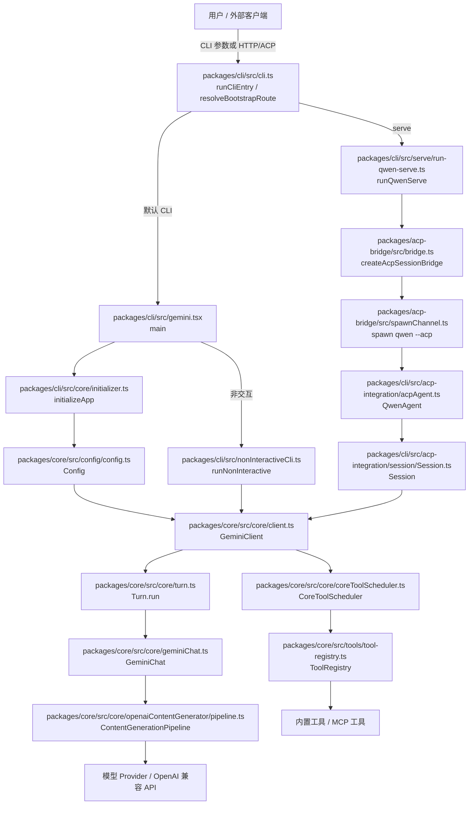

[上一篇：00-docs-style-guide](00-docs-style-guide.md) · [总目录](README.md) · [下一篇：02-简单例子-全路径走读](02-简单例子-全路径走读.md)

# 简单框架：qwen-code 系统骨架

> **场景**：先不追细节，只建立 `qwen-code` 的运行时骨架：CLI 入口、核心引擎、工具系统、ACP 桥、serve daemon、模型 Provider 各自负责什么，以及一次请求大致怎么流动。
> **时间**：2026-08-21 CST。
> **工具版本**：仓库 `@qwen-code/qwen-code` 当前工作区版本 `0.21.14`；Node.js 要求 `>=22`。

> **阅读说明**：本文是第一层文档，只讲边界和主路径，不展开每个函数、每个分支。源码行号只用于定位，不视为稳定 API；当前工作区源码为权威。

---

## 本文件内容

1. [项目是什么](#1-项目是什么)
2. [运行时主要模块](#2-运行时主要模块)
3. [系统骨架图](#3-系统骨架图)
4. [主数据流](#4-主数据流)
5. [关键源码入口](#5-关键源码入口)
6. [第一层结论](#6-第一层结论)

其余阶段见[总目录](README.md)。

---

## 1. 项目是什么

`qwen-code` 是一个 Node.js/TypeScript 编写的 AI 编码助手 CLI 与 daemon 系统。它接收用户 prompt，加载配置与工具，调用模型生成响应；当模型要求执行工具时，由工具调度器执行文件读写、Shell、搜索、编辑等操作，再把工具结果回传给模型，最终把流式响应输出到 CLI 或通过 ACP/HTTP 暴露给外部客户端。

核心包是 monorepo 中的：

- `packages/core`：核心引擎、配置、模型客户端、工具、服务、agents、memory、MCP、telemetry。
- `packages/cli`：CLI 入口、交互式/非交互式运行、ACP agent、serve daemon、HTTP 路由。
- `packages/acp-bridge`：daemon 与 ACP agent 之间的桥接、NDJSON 传输、权限与事件转发。
- 其他包：`channels`、`web-shell`、`desktop`、SDK 等，属于扩展面。

---

## 2. 运行时主要模块

| 模块 | 主要职责 | 关键文件/函数 |
| --- | --- | --- |
| CLI 入口 | 解析启动参数，决定走 `serve`、`mcp`、`help`、`version` 或默认 CLI | `packages/cli/src/cli.ts` 的 `runCliEntry`、`resolveBootstrapRoute`、`runCliEntryPoint` |
| CLI 启动 | 加载 settings、worktree、resume picker、config，初始化应用，分流交互式/非交互式 | `packages/cli/src/gemini.tsx` 的 `main` |
| 应用初始化 | 初始化 `Config`、工具注册表、skills、hooks、MCP 后台发现、模型客户端 | `packages/cli/src/core/initializer.ts` 的 `initializeApp` |
| 非交互式运行 | 消费 prompt，创建 goal runtime，处理模型流与工具批处理，输出结果 | `packages/cli/src/nonInteractiveCli.ts` 的 `runNonInteractive` |
| 核心客户端 | 编排一次消息流：hooks、memory、compaction、tool calls、stop hooks、next-speaker | `packages/core/src/core/client.ts` 的 `GeminiClient.sendMessageStream` |
| Turn | 把底层 `GeminiChat` 流事件转换为上层 `ServerGeminiStreamEvent` | `packages/core/src/core/turn.ts` 的 `Turn.run` |
| Chat | 管理历史、压缩、重试、fallback、token 恢复、模型流处理 | `packages/core/src/core/geminiChat.ts` 的 `GeminiChat.sendMessageStream` |
| 内容生成 | 按模型解析 provider，创建 OpenAI 兼容内容生成器并执行流 | `packages/core/src/core/baseLlmClient.ts`、`contentGenerator.ts`、`openaiContentGenerator/pipeline.ts` |
| 工具系统 | 注册内置工具、MCP 工具、禁用工具；调度工具调用、权限、执行、截断 | `packages/core/src/tools/tool-registry.ts`、`packages/core/src/core/coreToolScheduler.ts` |
| ACP bridge | daemon 与 `qwen --acp` 子进程之间的会话桥、权限、事件、NDJSON 传输 | `packages/acp-bridge/src/bridge.ts`、`bridgeClient.ts`、`spawnChannel.ts`、`ndJsonStream.ts` |
| ACP agent | 作为 ACP 服务端暴露 `newSession`、`loadSession`、`prompt`、`cancel` | `packages/cli/src/acp-integration/acpAgent.ts` 的 `QwenAgent` |
| Session | 管理单会话 prompt、工具调用、队列、权限、压缩 | `packages/cli/src/acp-integration/session/Session.ts` |
| Serve daemon | 启动 daemon、创建 Express app、挂载 WebShell/ACP HTTP/Local Control/scheduled tasks、drain | `packages/cli/src/serve/run-qwen-serve.ts`、`packages/cli/src/serve/server.ts` |

---

## 3. 系统骨架图



---

## 4. 主数据流

### 4.1 非交互 CLI 主路径

```text
用户输入
  │  qwen -p "列出当前目录"
  ▼
CLI 入口
  │  resolveBootstrapRoute 判断默认 CLI
  ▼
main()
  │  加载 settings / config / initializeApp
  ▼
runNonInteractive()
  │  创建 goal runtime，发送 prompt
  ▼
GeminiClient.sendMessageStream()
  │  编排 hooks / memory / tool calls
  ▼
Turn.run()
  │  把 GeminiChat 流事件转成上层事件
  ▼
GeminiChat.sendMessageStream()
  │  组装历史，调用模型流
  ▼
ContentGenerationPipeline.executeStream()
  │  请求 Provider，转换 OpenAI chunk
  ▼
模型响应 / tool call
  │  若 tool call，进入 CoreToolScheduler
  ▼
工具结果回传模型
  │  继续流式生成
  ▼
输出适配器
  │  文本 / JSON / stream-json
  ▼
CLI 退出
```

### 4.2 serve daemon 主路径

```text
外部客户端
  │  HTTP / ACP
  ▼
qwen serve
  │  runQwenServe
  ▼
createServeApp
  │  Express 中间件与路由
  ▼
createAcpSessionBridge
  │  管理会话与权限
  ▼
spawn qwen --acp
  │  NDJSON channel
  ▼
QwenAgent / Session
  │  复用核心引擎
  ▼
模型 / 工具执行
  │  事件回传 bridge
  ▼
HTTP / ACP 响应
```

---

## 5. 关键源码入口

| 入口 | 文件 | 说明 |
| --- | --- | --- |
| CLI 路由 | `packages/cli/src/cli.ts, 第 218-565 行` | `resolveBootstrapRoute` 决定启动路径，`runCliEntry` 执行入口，`runCliEntryPoint` 是最终调用点 |
| 默认 CLI 启动 | `packages/cli/src/gemini.tsx, 第 344 行起` | `main()` 加载配置并分流交互式/非交互式 |
| 应用初始化 | `packages/cli/src/core/initializer.ts, 第 57 行起` | `initializeApp` 初始化核心配置与 IDE 连接 |
| 非交互运行 | `packages/cli/src/nonInteractiveCli.ts, 第 497 行起` | `runNonInteractive` 是 `-p` 模式主循环 |
| 核心客户端 | `packages/core/src/core/client.ts, 第 2313 行起` | `GeminiClient.sendMessageStream` 是核心编排入口 |
| Turn | `packages/core/src/core/turn.ts, 第 544 行起` | `Turn.run` 转换流事件 |
| Chat | `packages/core/src/core/geminiChat.ts, 第 2310 行起` | `GeminiChat.sendMessageStream` 管理模型流 |
| OpenAI 流 | `packages/core/src/core/openaiContentGenerator/pipeline.ts, 第 592 行起` | `ContentGenerationPipeline.executeStream` 执行 Provider 流 |
| 工具调度 | `packages/core/src/core/coreToolScheduler.ts, 第 2297 行起` | `CoreToolScheduler._schedule` 调度工具调用 |
| daemon | `packages/cli/src/serve/run-qwen-serve.ts, 第 2103 行起` | `runQwenServe` 启动 daemon |
| serve app | `packages/cli/src/serve/server.ts, 第 710 行起` | `createServeApp` 创建 Express 应用 |
| bridge | `packages/acp-bridge/src/bridge.ts, 第 2503 行起` | `createAcpSessionBridge` 创建会话桥 |
| ACP agent | `packages/cli/src/acp-integration/acpAgent.ts, 第 5191 行起` | `QwenAgent.newSession` 创建会话 |
| Session | `packages/cli/src/acp-integration/session/Session.ts, 第 3705 行起` | `Session.prompt` 处理会话 prompt |

---

## 6. 第一层结论

- `qwen-code` 的核心是“CLI/daemon 入口 → 配置初始化 → 核心客户端 → 模型流 → 工具调度 → 输出”。
- 非交互 CLI 是最小主路径，适合作为第二层全路径例子。
- serve daemon 是同一核心引擎的另一种宿主，通过 ACP bridge 和 HTTP 暴露给外部客户端。
- 第一层只建立骨架；下一层用一个真实最小例子把主成功路径走通。

---

[上一篇：00-docs-style-guide](00-docs-style-guide.md) · [总目录](README.md) · [下一篇：02-简单例子-全路径走读](02-简单例子-全路径走读.md)
