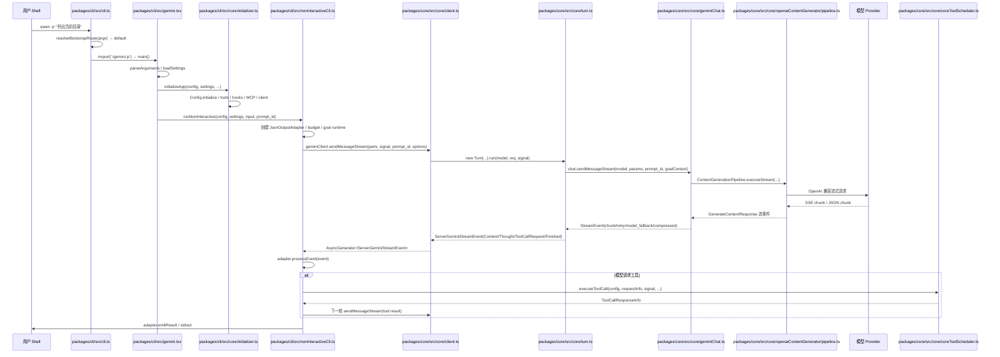

[上一篇：01-简单框架-系统骨架](01-简单框架-系统骨架.md) · [总目录](README.md) · [下一篇：03-详细逐步说明-主链路拆解](03-详细逐步说明-主链路拆解.md)

# 简单例子：`qwen -p "列出当前目录"` 全路径走读

> **场景**：用一条最小非交互命令 `qwen -p "列出当前目录"` 走通主成功路径：CLI 入口 → 配置初始化 → 非交互运行 → 核心客户端 → 模型流 → 工具执行 → 输出适配器 → 退出。
> **时间**：2026-08-21 CST。
> **工具版本**：仓库 `@qwen-code/qwen-code` 当前工作区版本 `0.21.14`；Node.js 要求 `>=22`。

> **阅读说明**：本文是第二层文档，只走主成功路径，失败、重试、边界条件点到为止。源码行号只用于定位，不视为稳定 API；当前工作区源码为权威。

---

## 本文件内容

1. [示例命令与输入输出](#1-示例命令与输入输出)
2. [端到端 ASCII 流程](#2-端到端-ascii-流程)
3. [Mermaid 全路径时序图](#3-mermaid-全路径时序图)
4. [逐跳源码索引](#4-逐跳源码索引)
5. [关键参数与返回值](#5-关键参数与返回值)
6. [第二层结论](#6-第二层结论)

其余阶段见[总目录](README.md)。

---

## 1. 示例命令与输入输出

### 1.1 命令

```bash
qwen -p "列出当前目录"
```

### 1.2 脱敏输入

| 字段 | 值 |
| --- | --- |
| 命令 | `qwen -p "列出当前目录"` |
| prompt | `列出当前目录` |
| 运行模式 | 非交互 CLI |
| 输出格式 | 默认文本或 JSON，取决于配置 |
| 可能触发的工具 | `ls` 或 `shell`，取决于模型决策 |

### 1.3 脱敏输出

```text
systemMessage
assistant 开始
模型文本：我将列出当前目录。
tool call：ls
tool result：...
模型文本：当前目录包含 ...
assistant 结束
```

---

## 2. 端到端 ASCII 流程

```text
┌────────────┐        ┌──────────────────────────┐        ┌──────────────────────────────┐        ┌──────────────────────────────┐
│ 用户 Shell  │        │  packages/cli            │        │  packages/core               │        │  模型 Provider / 工具         │
└────────────┘        └──────────────────────────┘        └──────────────────────────────┘        └──────────────────────────────┘
      │                         │                                      │                                      │
      │ Step 1: qwen -p "..."   │                                      │                                      │
      │────────────────────────▶│                                      │                                      │
      │                         │ Step 2: resolveBootstrapRoute        │                                      │
      │                         │  default → import gemini.js           │                                      │
      │                         │─────────────────────────────────────▶│                                      │
      │                         │ Step 3: main() 加载 settings/config  │                                      │
      │                         │  initializeApp()                     │                                      │
      │                         │─────────────────────────────────────▶│                                      │
      │                         │ Step 4: runNonInteractive()          │                                      │
      │                         │  adapter / goal runtime / budget      │                                      │
      │                         │─────────────────────────────────────▶│                                      │
      │                         │ Step 5: geminiClient.sendMessageStream│                                      │
      │                         │─────────────────────────────────────▶│                                      │
      │                         │                                      │ Step 6: Turn.run() → GeminiChat   │
      │                         │                                      │─────────────────────────────────────▶│
      │                         │                                      │ Step 7: ContentGenerationPipeline  │
      │                         │                                      │ 请求 Provider，转换 chunk          │
      │                         │                                      │─────────────────────────────────────▶│
      │                         │                                      │◀─────────────────────────────────────│
      │                         │                                      │ Step 8: 模型返回文本 / tool call   │
      │                         │◀─────────────────────────────────────│                                      │
      │                         │ Step 9: 若 tool call，CoreToolScheduler│                                      │
      │                         │─────────────────────────────────────▶│                                      │
      │                         │                                      │─────────────────────────────────────▶│
      │                         │                                      │◀─────────────────────────────────────│
      │                         │ Step 10: 工具结果回传模型，继续生成    │                                      │
      │                         │─────────────────────────────────────▶│                                      │
      │◀────────────────────────│ Step 11: adapter 输出最终结果         │                                      │
      │                         │                                      │                                      │
```

---

## 3. Mermaid 全路径时序图



---

## 4. 逐跳源码索引

| 序号 | 动作 | 内部调用链 | 说明 |
| --- | --- | --- | --- |
| 1 | CLI 入口 | `packages/cli/src/cli.ts, 第 351-565 行` | `runCliEntry` 先处理 managed update，再 `resolveBootstrapRoute`；默认路由导入 `./gemini.js` 并调用 `main()` |
| 2 | 路由判断 | `packages/cli/src/cli.ts, 第 218-240 行` | `--version/-v`、`serve`、`mcp`、`--help` 走快速路径，其余走 `default` |
| 3 | 默认启动 | `packages/cli/src/gemini.tsx, 第 344 行起` | `main()` 解析参数、加载 settings、处理 sandbox/theme、初始化应用 |
| 4 | 应用初始化 | `packages/cli/src/core/initializer.ts, 第 57 行起` | `initializeApp` 初始化 `Config`、工具、hooks、MCP、模型客户端 |
| 5 | 非交互运行 | `packages/cli/src/nonInteractiveCli.ts, 第 497 行起` | `runNonInteractive` 创建输出适配器、budget、goal runtime，进入主循环 |
| 6 | 发送消息 | `packages/cli/src/nonInteractiveCli.ts, 第 2347-2378 行` | `geminiClient.sendMessageStream(currentMessages[0]?.parts || [], signal, prompt_id, options)` |
| 7 | 核心编排 | `packages/core/src/core/client.ts, 第 2313 行起` | `GeminiClient.sendMessageStream` 处理 interaction、goal、hooks、memory、tool calls |
| 8 | Turn 转换 | `packages/core/src/core/turn.ts, 第 544 行起` | `Turn.run` 把 `GeminiChat` 流事件转换为 `ServerGeminiStreamEvent` |
| 9 | Chat 流 | `packages/core/src/core/geminiChat.ts, 第 2310 行起` | `GeminiChat.sendMessageStream` 管理历史、压缩、重试、fallback、模型流 |
| 10 | Provider 流 | `packages/core/src/core/openaiContentGenerator/pipeline.ts, 第 592 行起` | `ContentGenerationPipeline.executeStream` 执行 OpenAI 兼容流并转换 chunk |
| 11 | 工具执行 | `packages/core/src/core/coreToolScheduler.ts, 第 2297 行起` | `CoreToolScheduler._schedule` 调度工具调用、权限、执行、截断 |
| 12 | 输出 | `packages/cli/src/nonInteractiveCli.ts, 第 2389 行起` | `adapter.processEvent(event)` 消费事件，最终 `emitResult` 输出 |

---

## 5. 关键参数与返回值

### 5.1 `runNonInteractive` 参数

| 参数 | 类型 | 说明 |
| --- | --- | --- |
| `config` | `Config` | 已初始化的核心配置 |
| `settings` | `LoadedSettings` | 用户 settings |
| `input` | `string` | 原始 prompt，例如 `列出当前目录` |
| `prompt_id` | `string` | 本次 prompt 的稳定 ID |
| `options` | `RunNonInteractiveOptions` | 可选 adapter、abortController、userMessage、sendMessageType 等 |

### 5.2 `sendMessageStream` 参数

| 参数 | 类型 | 说明 |
| --- | --- | --- |
| `request` | `PartListUnion` | 当前消息 parts，例如 `[{ text: '列出当前目录' }]` |
| `callerSignal` | `AbortSignal` | 取消信号 |
| `prompt_id` | `string` | prompt ID |
| `options` | `SendMessageOptions` | `type`、`modelOverride`、`submittedPrompt`、goal 相关字段 |
| `turns` | `number` | 最大 turns，默认 `MAX_TURNS` |

### 5.3 返回值

- `GeminiClient.sendMessageStream` 返回 `AsyncGenerator<ServerGeminiStreamEvent, Turn>`。
- `Turn.run` 返回 `AsyncGenerator<ServerGeminiStreamEvent>`。
- `GeminiChat.sendMessageStream` 返回 `Promise<AsyncGenerator<StreamEvent>>`。
- `ContentGenerationPipeline.executeStream` 产出模型流事件，最终被转换为 `GenerateContentResponse` 风格事件。

---

## 6. 第二层结论

- 最小全路径是：`qwen -p` → `runCliEntry` → `main` → `initializeApp` → `runNonInteractive` → `GeminiClient.sendMessageStream` → `Turn.run` → `GeminiChat.sendMessageStream` → `ContentGenerationPipeline.executeStream` → 模型/工具 → adapter 输出。
- 主成功路径中，模型可能直接返回文本，也可能先返回 `ToolCallRequest`，由 `CoreToolScheduler` 执行工具后再回传结果。
- 下一层将按调用顺序逐步拆开每一跳，讲清参数、返回值、错误传播和状态变化。

---

[上一篇：01-简单框架-系统骨架](01-简单框架-系统骨架.md) · [总目录](README.md) · [下一篇：03-详细逐步说明-主链路拆解](03-详细逐步说明-主链路拆解.md)
