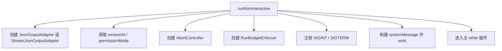
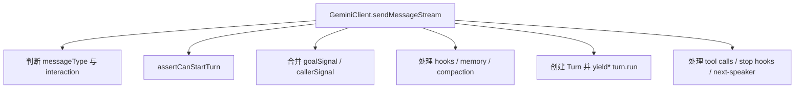
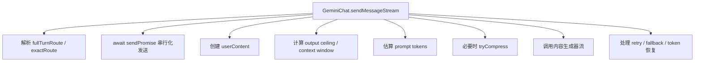

[上一篇：02-简单例子-全路径走读](02-简单例子-全路径走读.md) · [总目录](README.md) · [下一篇：04-核心模块与类关系](04-核心模块与类关系.md)

# 详细逐步说明：`qwen -p` 主链路拆解

> **场景**：在第二层全路径例子基础上，按调用顺序逐步拆开 `qwen -p "列出当前目录"` 的每一跳，讲清谁调用谁、参数如何传递、返回值如何消费、错误如何传播、状态如何变化。
> **时间**：2026-08-21 CST。
> **工具版本**：仓库 `@qwen-code/qwen-code` 当前工作区版本 `0.21.14`；Node.js 要求 `>=22`。

> **阅读说明**：本文是第三层文档，聚焦主成功路径的逐步拆解。源码行号只用于定位，不视为稳定 API；当前工作区源码为权威。

---

## 本文件内容

1. [步骤一：CLI 入口与路由](#1-步骤一cli-入口与路由)
2. [步骤二：默认启动与参数解析](#2-步骤二默认启动与参数解析)
3. [步骤三：应用初始化](#3-步骤三应用初始化)
4. [步骤四：非交互运行准备](#4-步骤四非交互运行准备)
5. [步骤五：核心客户端发送消息](#5-步骤五核心客户端发送消息)
6. [步骤六：Turn 事件转换](#6-步骤六turn-事件转换)
7. [步骤七：GeminiChat 模型流](#7-步骤七geminichat-模型流)
8. [步骤八：OpenAI 兼容内容生成](#8-步骤八openai-兼容内容生成)
9. [步骤九：工具调用执行](#9-步骤九工具调用执行)
10. [步骤十：输出与退出](#10-步骤十输出与退出)

其余阶段见[总目录](README.md)。

---

## 1. 步骤一：CLI 入口与路由

### 1.1 谁调用谁

用户执行 `qwen -p "列出当前目录"` 后，Node.js 启动 `packages/cli` 的入口，最终进入 `packages/cli/src/cli.ts` 的 `runCliEntry`。

### 1.2 参数如何传递

- `runCliEntry(rawArgv: readonly string[] = process.argv.slice(2))` 接收 CLI 参数。
- 对示例来说，`rawArgv` 大致是 `['-p', '列出当前目录']`。
- `runCliEntry` 先检查 `QWEN_CODE_MANAGED_NPM_UPDATE_VERSION`，再调用 `normalizeServeFastPathArgv(rawArgv)` 和 `resolveBootstrapRoute(argv)`。

### 1.3 返回值如何消费

- `resolveBootstrapRoute` 返回 `BootstrapRoute`，示例中返回 `'default'`。
- `runCliEntry` 对非 `serve` 路由删除 `QWEN_CODE_EXTERNAL_TOOL_GUARD_TOKEN`，然后动态导入 `./gemini.js` 并调用 `main()`。

### 1.4 源码索引

| 动作 | 源码 |
| --- | --- |
| 路由判断 | `packages/cli/src/cli.ts, 第 218-240 行` |
| 入口执行 | `packages/cli/src/cli.ts, 第 351-565 行` |
| 默认路由导入 `main` | `packages/cli/src/cli.ts, 第 521-565 行` |

### 1.5 状态变化

- 进程进入 CLI 默认路径。
- 非 `serve` 路径会清理外部工具 guard token，避免子进程继承。

---

## 2. 步骤二：默认启动与参数解析

### 2.1 谁调用谁

`runCliEntry` 动态导入 `packages/cli/src/gemini.tsx` 并调用 `main()`。

### 2.2 参数如何传递

- `main()` 无显式参数，内部读取 `process.argv`。
- 先设置 startup profiler、unhandled rejection handler、warning handler。
- 读取并删除私有 ACP capability 和 external tool guard 环境变量。
- 调用 `parseArguments()` 得到 `argv`。

### 2.3 返回值如何消费

- `argv` 包含 `-p` 对应的 prompt 参数。
- `main()` 根据 `argv.acp`、`argv.experimentalAcp`、`argv.bare`、`argv.listExtensions` 等分流。
- 示例走普通 CLI 路径，继续加载 settings 和 config。

### 2.4 源码索引

| 动作 | 源码 |
| --- | --- |
| `main` 入口 | `packages/cli/src/gemini.tsx, 第 344 行起` |
| 参数解析 | `packages/cli/src/gemini.tsx, 第 380-390 行附近` |
| settings 加载 | `packages/cli/src/gemini.tsx, 第 420-440 行附近` |
| 初始化应用调用 | `packages/cli/src/gemini.tsx, 第 1061-1070 行附近` |

### 2.5 状态变化

- 用户 settings 被加载为 `LoadedSettings`。
- 主题、DNS、sandbox 等启动前准备完成。
- 后续进入 `initializeApp`。

---

## 3. 步骤三：应用初始化

### 3.1 谁调用谁

`main()` 调用 `packages/cli/src/core/initializer.ts` 的 `initializeApp(config, settings, options)`。

### 3.2 参数如何传递

| 参数 | 说明 |
| --- | --- |
| `config` | 已创建的 `Config` 实例 |
| `settings` | 已加载的 `LoadedSettings` |
| `options` | `InitializeAppOptions`，可包含 `deferIdeConnection` 等 |

### 3.3 返回值如何消费

- `initializeApp` 返回 `InitializationResult`，包含 `authError`、`themeError`、`shouldOpenAuthDialog`、`geminiMdFileCount`。
- 示例主成功路径中，这些结果用于后续警告或 UI 决策，不阻断非交互运行。

### 3.4 内部调用链

```mermaid
flowchart TD
  A[initializeApp] --> B[initializeI18n]
  A --> C[performInitialAuth]
  A --> D[validateTheme]
  A --> E[connectIdeForStartup]
  C --> F[config.getModelsConfig().getCurrentAuthType()]
  E --> G[IDE 连接 / 启动桥接]
```

### 3.5 源码索引

| 动作 | 源码 |
| --- | --- |
| `initializeApp` | `packages/cli/src/core/initializer.ts, 第 57-90 行` |
| `Config.initialize` | `packages/core/src/config/config.ts, 第 2641-2760 行` |
| `initializeInternal` | `packages/core/src/config/config.ts, 第 2698 行起` |

### 3.6 状态变化

- `Config` 初始化完成，工具注册表、hooks、MCP、模型客户端等核心服务可用。
- 非交互运行可以安全获取 `config.getGeminiClient()`。

---

## 4. 步骤四：非交互运行准备

### 4.1 谁调用谁

`main()` 在非交互分支动态导入 `packages/cli/src/nonInteractiveCli.ts`，调用 `runNonInteractive(config, settings, input, prompt_id, options)`。

### 4.2 参数如何传递

| 参数 | 示例值/说明 |
| --- | --- |
| `config` | 已初始化 `Config` |
| `settings` | 已加载 settings |
| `input` | `列出当前目录` |
| `prompt_id` | 本次 prompt 的稳定 ID |
| `options` | 可选 adapter、abortController、userMessage、sendMessageType 等 |

### 4.3 返回值如何消费

- `runNonInteractive` 返回 `Promise<number>`，即进程退出码。
- 主成功路径最终返回 `0`。

### 4.4 内部准备



### 4.5 源码索引

| 动作 | 源码 |
| --- | --- |
| `runNonInteractive` 入口 | `packages/cli/src/nonInteractiveCli.ts, 第 497 行起` |
| 输出适配器创建 | `packages/cli/src/nonInteractiveCli.ts, 第 500-520 行附近` |
| budget 与信号处理 | `packages/cli/src/nonInteractiveCli.ts, 第 760-900 行附近` |
| 主循环 | `packages/cli/src/nonInteractiveCli.ts, 第 2280 行起` |

### 4.6 状态变化

- 输出适配器确定：文本、JSON 或 stream-json。
- 运行预算和取消信号就绪。
- `currentMessages` 初始化为 `[{ role: 'user', parts: initialParts }]`。

---

## 5. 步骤五：核心客户端发送消息

### 5.1 谁调用谁

`runNonInteractive` 调用 `config.getGeminiClient().sendMessageStream(...)`。

### 5.2 参数如何传递

```ts
const responseStream = geminiClient.sendMessageStream(
  currentMessages[0]?.parts || [],
  abortController.signal,
  currentPromptId,
  {
    type: sendType,
    modelOverride,
    ...(isFirstTurn &&
      sendType === SendMessageType.UserQuery &&
      !options.continueInterrupted &&
      submittedPrompt.trim().length > 0 && { submittedPrompt }),
  },
);
```

- `request`：当前消息 parts。
- `callerSignal`：`AbortController.signal`。
- `prompt_id`：当前 prompt ID。
- `options.type`：首轮为 `SendMessageType.UserQuery`。
- `options.submittedPrompt`：首轮用户原始 prompt。

### 5.3 返回值如何消费

- 返回 `AsyncGenerator<ServerGeminiStreamEvent, Turn>`。
- `runNonInteractive` 用 `for await (const event of responseStream)` 消费事件。
- 每个事件交给 `adapter.processEvent(event)`。

### 5.4 核心客户端内部



### 5.5 源码索引

| 动作 | 源码 |
| --- | --- |
| `sendMessageStream` 入口 | `packages/core/src/core/client.ts, 第 2313 行起` |
| 非交互调用点 | `packages/cli/src/nonInteractiveCli.ts, 第 2347-2378 行` |
| 事件消费 | `packages/cli/src/nonInteractiveCli.ts, 第 2378-2420 行` |

### 5.6 状态变化

- 核心客户端开始一次 turn。
- 若首轮 `UserQuery`，会调用 `config.assertCanStartTurn()`。
- 后续事件流驱动输出和工具执行。

---

## 6. 步骤六：Turn 事件转换

### 6.1 谁调用谁

`GeminiClient.sendMessageStream` 创建 `Turn` 并调用 `turn.run(model, req, signal)`。

### 6.2 参数如何传递

| 参数 | 说明 |
| --- | --- |
| `model` | 当前模型名 |
| `req` | `PartListUnion`，用户消息 parts |
| `signal` | `AbortSignal` |

### 6.3 返回值如何消费

- `Turn.run` 返回 `AsyncGenerator<ServerGeminiStreamEvent>`。
- 它把底层 `StreamEvent` 转换为上层事件：
  - `retry` → `GeminiEventType.Retry`
  - `model_fallback` → `GeminiEventType.ModelFallback`
  - `compressed` → `GeminiEventType.ChatCompressed`
  - chunk → `Content`、`Thought`、`ToolCallRequest`、`Citation`、`Finished`

### 6.4 源码索引

| 动作 | 源码 |
| --- | --- |
| `Turn` 类 | `packages/core/src/core/turn.ts, 第 529 行起` |
| `run` 方法 | `packages/core/src/core/turn.ts, 第 544 行起` |
| 事件转换 | `packages/core/src/core/turn.ts, 第 560-700 行` |

### 6.5 状态变化

- `pendingToolCalls`、`pendingCitations`、`finishReason` 在 retry/fallback 时清空。
- 模型 chunk 被转换为上层 UI/CLI 可消费事件。

---

## 7. 步骤七：GeminiChat 模型流

### 7.1 谁调用谁

`Turn.run` 调用 `this.chat.sendMessageStream(model, params, prompt_id, goalContext)`。

### 7.2 参数如何传递

```ts
const responseStream = await this.chat.sendMessageStream(
  model,
  {
    message: req,
    config: {
      abortSignal: signal,
    },
  },
  this.prompt_id,
  this.goalContext,
);
```

### 7.3 返回值如何消费

- 返回 `Promise<AsyncGenerator<StreamEvent>>`。
- `Turn.run` 遍历 `StreamEvent`，转换为上层事件。

### 7.4 内部逻辑



### 7.5 源码索引

| 动作 | 源码 |
| --- | --- |
| `sendMessageStream` 入口 | `packages/core/src/core/geminiChat.ts, 第 2310 行起` |
| 串行化发送 | `packages/core/src/core/geminiChat.ts, 第 2320-2340 行附近` |
| 压缩与 token 估算 | `packages/core/src/core/geminiChat.ts, 第 2400-2500 行附近` |

### 7.6 状态变化

- `sendPromise` 保证同一 chat 的发送串行化。
- 历史、压缩状态、token 计数在发送过程中更新。
- 模型流事件被返回给 `Turn.run`。

---

## 8. 步骤八：OpenAI 兼容内容生成

### 8.1 谁调用谁

`GeminiChat` 通过 `BaseLlmClient.resolveForModel` 解析模型路由，最终调用 `ContentGenerationPipeline.executeStream`。

### 8.2 参数如何传递

- 模型名、请求内容、采样参数、abort signal、stream 配置等被封装进内容生成请求。
- `ContentGenerationPipeline.executeStream` 执行 OpenAI 兼容流式请求。

### 8.3 返回值如何消费

- 产出模型 chunk，经 `convertOpenAIChunkToGemini` 转换为 `GenerateContentResponse` 风格事件。
- 事件向上返回给 `GeminiChat`，再经 `Turn.run` 转换。

### 8.4 源码索引

| 动作 | 源码 |
| --- | --- |
| `BaseLlmClient.resolveForModel` | `packages/core/src/core/baseLlmClient.ts` |
| `createContentGenerator` | `packages/core/src/core/contentGenerator.ts` |
| `OpenAIContentGenerator` | `packages/core/src/core/openaiContentGenerator/openaiContentGenerator.ts` |
| `ContentGenerationPipeline.executeStream` | `packages/core/src/core/openaiContentGenerator/pipeline.ts, 第 592 行起` |
| chunk 转换 | `packages/core/src/core/openaiContentGenerator/converter.ts` |

### 8.5 状态变化

- 模型 Provider 返回的 SSE/JSON chunk 被转换为内部事件。
- reasoning、tool-call、thinking-tag 等字段被规范化。

---

## 9. 步骤九：工具调用执行

### 9.1 谁调用谁

当 `Turn.run` 产出 `GeminiEventType.ToolCallRequest` 时，`runNonInteractive` 收集 `ToolCallRequestInfo`，随后调用 `executeToolCall`。

### 9.2 参数如何传递

```ts
const response = await executeToolCall(
  config,
  requestInfo,
  activeGoalTurn
    ? AbortSignal.any([abortController.signal, activeGoalTurn.controller.signal])
    : abortController.signal,
  {
    recordToolResult: false,
    onToolResultFullTurnModel: ...,
    outputUpdateHandler,
    onAllToolCallsComplete: ...,
    runtimeView,
  },
);
```

### 9.3 返回值如何消费

- 返回 `ToolCallResponseInfo`，包含 `responseParts`、`resultDisplay`、`error`、`errorType`、`executionStatus` 等。
- `runNonInteractive` 调用 `adapter.emitToolResult(requestInfo, toolResponse)`。
- 工具结果作为下一轮 `sendMessageStream` 的 `ToolResult` 消息回传模型。

### 9.4 内部调用链

```mermaid
flowchart TD
  A[runNonInteractive 收到 ToolCallRequest] --> B[executeToolCall]
  B --> C[new CoreToolScheduler]
  C --> D[schedule(toolCallRequest, signal, runtimeView)]
  D --> E[_schedule]
  E --> F[权限检查 / auto mode / hooks]
  E --> G[_executeToolCallBody]
  G --> H[具体工具执行]
  H --> I[结果截断 / 持久化 / 事件]
```

### 9.5 源码索引

| 动作 | 源码 |
| --- | --- |
| `executeToolCall` | `packages/core/src/core/nonInteractiveToolExecutor.ts, 第 33-70 行` |
| `CoreToolScheduler.schedule` | `packages/core/src/core/coreToolScheduler.ts, 第 2209-2244 行` |
| `_schedule` | `packages/core/src/core/coreToolScheduler.ts, 第 2297 行起` |
| `_executeToolCallBody` | `packages/core/src/core/coreToolScheduler.ts, 第 4423 行起` |

### 9.6 状态变化

- 工具调用进入调度器，权限和 hooks 决定是否执行。
- 工具结果被记录、截断，并回传给模型。
- 若模型继续请求工具，主循环继续；否则进入最终输出。

---

## 10. 步骤十：输出与退出

### 10.1 谁调用谁

`runNonInteractive` 消费完 `responseStream` 后，调用 adapter 的最终输出方法，并返回退出码。

### 10.2 参数如何传递

- `adapter.processEvent(event)` 处理每个流事件。
- 最终调用 `adapter.emitResult(result)` 或文本输出。
- `runNonInteractive` 返回 `Promise<number>`。

### 10.3 返回值如何消费

- `main()` 接收 `runNonInteractive` 的退出码，设置 `process.exitCode` 或直接退出。
- 主成功路径返回 `0`。

### 10.4 源码索引

| 动作 | 源码 |
| --- | --- |
| 事件处理 | `packages/cli/src/nonInteractiveCli.ts, 第 2389 行起` |
| 最终输出 | `packages/cli/src/nonInteractiveCli.ts, 第 2400-2600 行附近` |
| 退出码返回 | `packages/cli/src/nonInteractiveCli.ts, 第 497 行起` |

### 10.5 状态变化

- 输出适配器完成最终消息。
- 清理 review worktree、chat recording、goal runtime 等资源。
- 进程退出。

---

[上一篇：02-简单例子-全路径走读](02-简单例子-全路径走读.md) · [总目录](README.md) · [下一篇：04-核心模块与类关系](04-核心模块与类关系.md)
