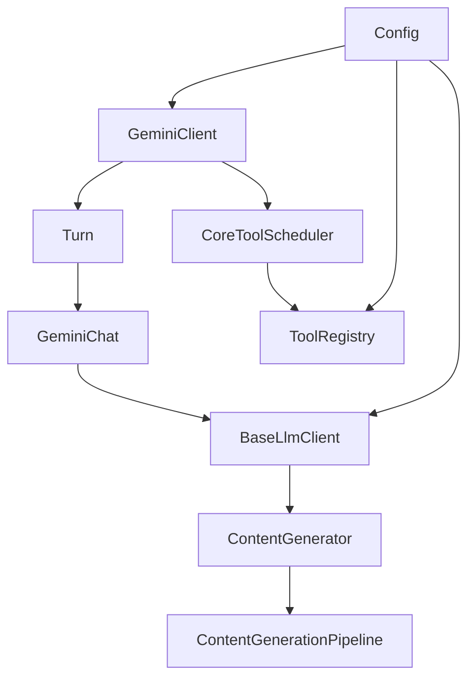

[上一篇：03-详细逐步说明-主链路拆解](03-详细逐步说明-主链路拆解.md) · [总目录](README.md) · [下一篇：05-API与接口设计](05-API与接口设计.md)

# 核心模块与类关系

> **场景**：补齐第一层到第三层未展开的核心类与模块关系，重点讲 `Config`、`GeminiClient`、`Turn`、`GeminiChat`、`BaseLlmClient`、`ContentGenerationPipeline`、`ToolRegistry`、`CoreToolScheduler` 的职责、依赖和关键方法。
> **时间**：2026-08-21 CST。
> **工具版本**：仓库 `@qwen-code/qwen-code` 当前工作区版本 `0.21.14`；Node.js 要求 `>=22`。

> **阅读说明**：本文是第四层模块补齐文档。源码行号只用于定位，不视为稳定 API；当前工作区源码为权威。

---

## 本文件内容

1. [核心类总览](#1-核心类总览)
2. [Config](#2-config)
3. [GeminiClient](#3-geminiclient)
4. [Turn](#4-turn)
5. [GeminiChat](#5-geminichat)
6. [BaseLlmClient 与 ContentGenerator](#6-basellmclient-与-contentgenerator)
7. [ToolRegistry](#7-toolregistry)
8. [CoreToolScheduler](#8-coretoolscheduler)
9. [类关系图](#9-类关系图)

其余阶段见[总目录](README.md)。

---

## 1. 核心类总览

| 类/模块 | 文件 | 职责 |
| --- | --- | --- |
| `Config` | `packages/core/src/config/config.ts, 第 1756 行` | 全局配置、服务注册、工具注册、模型客户端、hooks、MCP、memory、telemetry |
| `GeminiClient` | `packages/core/src/core/client.ts, 第 349 行` | 一次消息流的编排：hooks、memory、compaction、tool calls、stop hooks、next-speaker |
| `Turn` | `packages/core/src/core/turn.ts, 第 529 行` | 把 `GeminiChat` 流事件转换为 `ServerGeminiStreamEvent` |
| `GeminiChat` | `packages/core/src/core/geminiChat.ts, 第 1826 行` | 管理历史、压缩、重试、fallback、token 恢复、模型流 |
| `BaseLlmClient` | `packages/core/src/core/baseLlmClient.ts, 第 209 行` | 按模型解析 provider 和 content generator |
| `ContentGenerationPipeline` | `packages/core/src/core/openaiContentGenerator/pipeline.ts, 第 532 行` | 执行 OpenAI 兼容流式请求并转换 chunk |
| `ToolRegistry` | `packages/core/src/tools/tool-registry.ts, 第 195 行` | 注册内置工具、MCP 工具、禁用工具 |
| `CoreToolScheduler` | `packages/core/src/core/coreToolScheduler.ts, 第 1382 行` | 调度工具调用、权限、hooks、执行、截断、批处理 |

---

## 2. Config

### 2.1 设计初衷

`Config` 是核心引擎的“服务容器”和“配置聚合点”。CLI、ACP agent、daemon 都通过 `Config` 获取模型客户端、工具注册表、hooks、MCP、memory、telemetry 等服务，避免各入口重复初始化。

### 2.2 核心逻辑

- `initialize(options?)` 保证只初始化一次，若已初始化或正在关闭则抛错。
- `initializeOnce` 激活 chat recording，注册 session project dir，再调用 `initializeInternal`。
- `initializeInternal` 初始化文件服务、prompt/resource registry、extension manager、hooks、message bus、MCP、工具、模型客户端等。

### 2.3 关键方法

| 方法 | 说明 |
| --- | --- |
| `initialize` | 入口，设置 `initialized` 并调用 `initializeOnce` |
| `initializeOnce` | 单次初始化包装，处理失败清理 |
| `initializeInternal` | 实际初始化内部服务 |
| `getGeminiClient` | 获取核心客户端 |
| `getToolRegistry` | 获取工具注册表 |
| `getBaseLlmClient` | 获取模型路由客户端 |
| `getContentGeneratorConfig` | 获取当前内容生成配置 |
| `getApprovalMode` | 获取权限模式 |
| `getOutputFormat` | 获取输出格式 |

### 2.4 源码索引

| 动作 | 源码 |
| --- | --- |
| `Config` 类 | `packages/core/src/config/config.ts, 第 1756 行` |
| `initialize` | `packages/core/src/config/config.ts, 第 2641 行` |
| `initializeOnce` | `packages/core/src/config/config.ts, 第 2659 行` |
| `initializeInternal` | `packages/core/src/config/config.ts, 第 2698 行` |

---

## 3. GeminiClient

### 3.1 设计初衷

`GeminiClient` 是核心编排器。它不直接实现模型协议，而是把 `Turn`、`GeminiChat`、hooks、memory、tool scheduler 串起来，形成一次完整的 assistant turn。

### 3.2 核心逻辑

- `sendMessageStream` 接收 `PartListUnion`、`AbortSignal`、`prompt_id`、`SendMessageOptions`。
- 根据 `SendMessageType` 判断是否开始 interaction，并调用 `config.assertCanStartTurn()`。
- 合并 goal signal 与 caller signal。
- 处理 hooks、memory prefetch、compaction、tool calls、stop hooks、next-speaker。
- 返回 `AsyncGenerator<ServerGeminiStreamEvent, Turn>`。

### 3.3 关键方法

| 方法 | 说明 |
| --- | --- |
| `sendMessageStream` | 主入口，编排一次 turn |
| `tryCompressChat` | 手动压缩聊天历史 |
| `recordCompletedToolCall` | 记录完成的工具调用 |
| `getChat` | 获取 `GeminiChat` |

### 3.4 源码索引

| 动作 | 源码 |
| --- | --- |
| `GeminiClient` 类 | `packages/core/src/core/client.ts, 第 349 行` |
| `sendMessageStream` | `packages/core/src/core/client.ts, 第 2313 行起` |
| 递归/工具续轮 | `packages/core/src/core/client.ts, 第 3655-4107 行附近` |

---

## 4. Turn

### 4.1 设计初衷

`Turn` 是底层模型流和上层 UI/CLI 事件之间的适配层。它把 `GeminiChat` 的 `StreamEvent` 转换为 `ServerGeminiStreamEvent`，并处理 tool call 去重、citation、finish reason。

### 4.2 核心逻辑

- `run(model, req, signal)` 调用 `chat.sendMessageStream`。
- 遍历底层事件：
  - `retry` 清空 pending tool calls/citations/finishReason。
  - `model_fallback` 清空失败模型的部分状态。
  - `compressed` 转发为 `ChatCompressed`。
  - chunk 提取 text、thought、function calls、citations、finish reason。
- 返回上层事件流。

### 4.3 源码索引

| 动作 | 源码 |
| --- | --- |
| `Turn` 类 | `packages/core/src/core/turn.ts, 第 529 行` |
| `run` | `packages/core/src/core/turn.ts, 第 544 行起` |
| 事件转换 | `packages/core/src/core/turn.ts, 第 560-700 行` |

---

## 5. GeminiChat

### 5.1 设计初衷

`GeminiChat` 管理会话历史和模型请求。它负责压缩、重试、fallback、token 恢复、输出 token clamp，确保模型请求在上下文窗口内。

### 5.2 核心逻辑

- `sendMessageStream(model, params, prompt_id, goalContext?, options?)` 返回 `Promise<AsyncGenerator<StreamEvent>>`。
- 使用 `sendPromise` 串行化同一 chat 的发送。
- 创建 `userContent`，估算 prompt tokens，必要时 `tryCompress`。
- 调用内容生成器流，处理 retry、fallback、token 恢复。

### 5.3 源码索引

| 动作 | 源码 |
| --- | --- |
| `GeminiChat` 类 | `packages/core/src/core/geminiChat.ts, 第 1826 行` |
| `sendMessageStream` | `packages/core/src/core/geminiChat.ts, 第 2310 行起` |
| 压缩与 token 估算 | `packages/core/src/core/geminiChat.ts, 第 2400-2500 行附近` |

---

## 6. BaseLlmClient 与 ContentGenerator

### 6.1 设计初衷

`BaseLlmClient` 负责“模型名 → provider/content generator”的解析。`ContentGenerator` 抽象模型协议，`ContentGenerationPipeline` 是 OpenAI 兼容实现。

### 6.2 核心逻辑

- `BaseLlmClient.resolveForModel(model, options)` 解析模型路由。
- `createContentGenerator` 创建 `LazyContentGenerator`。
- `ContentGenerationPipeline.executeStream` 执行流式请求，`convertOpenAIChunkToGemini` 转换 chunk。

### 6.3 源码索引

| 动作 | 源码 |
| --- | --- |
| `BaseLlmClient` | `packages/core/src/core/baseLlmClient.ts, 第 209 行` |
| `createContentGenerator` | `packages/core/src/core/contentGenerator.ts` |
| `OpenAIContentGenerator` | `packages/core/src/core/openaiContentGenerator/openaiContentGenerator.ts` |
| `ContentGenerationPipeline` | `packages/core/src/core/openaiContentGenerator/pipeline.ts, 第 532 行` |
| `executeStream` | `packages/core/src/core/openaiContentGenerator/pipeline.ts, 第 592 行起` |
| chunk 转换 | `packages/core/src/core/openaiContentGenerator/converter.ts` |

---

## 7. ToolRegistry

### 7.1 设计初衷

`ToolRegistry` 统一管理工具工厂、MCP 工具、禁用工具，避免各入口直接散落注册逻辑。

### 7.2 核心逻辑

- `ToolFactory = () => Promise<AnyDeclarativeTool>` 支持懒加载。
- 注册内置工具、MCP 工具、禁用工具。
- 提供查询、过滤、启用/禁用能力。

### 7.3 源码索引

| 动作 | 源码 |
| --- | --- |
| `ToolFactory` | `packages/core/src/tools/tool-registry.ts, 第 36 行` |
| `ToolRegistry` | `packages/core/src/tools/tool-registry.ts, 第 195 行` |

---

## 8. CoreToolScheduler

### 8.1 设计初衷

`CoreToolScheduler` 是工具执行的统一调度器，处理权限、hooks、执行、截断、批处理、错误传播。

### 8.2 核心逻辑

- `schedule(request, signal, runtimeView)` 入队并调用 `_schedule`。
- `_schedule` 处理权限检查、auto mode、hooks、执行。
- `_executeToolCallBody` 执行具体工具，记录 span，处理结果截断和持久化。

### 8.3 源码索引

| 动作 | 源码 |
| --- | --- |
| `ToolCall` 类型 | `packages/core/src/core/coreToolScheduler.ts, 第 510 行` |
| `CoreToolScheduler` | `packages/core/src/core/coreToolScheduler.ts, 第 1382 行` |
| `schedule` | `packages/core/src/core/coreToolScheduler.ts, 第 2209 行` |
| `_schedule` | `packages/core/src/core/coreToolScheduler.ts, 第 2297 行` |
| `_executeToolCallBody` | `packages/core/src/core/coreToolScheduler.ts, 第 4423 行` |

---

## 9. 类关系图

---

[上一篇：03-详细逐步说明-主链路拆解](03-详细逐步说明-主链路拆解.md) · [总目录](README.md) · [下一篇：05-API与接口设计](05-API与接口设计.md)
