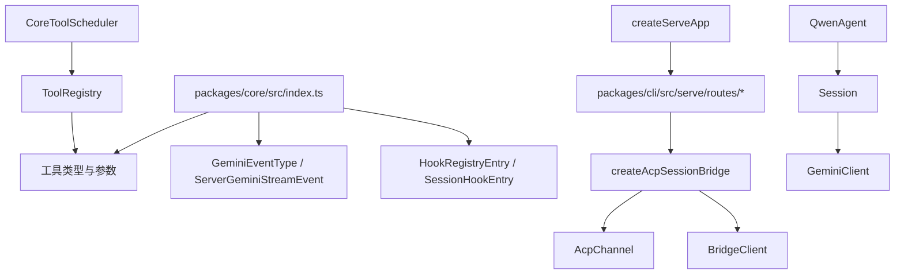

[上一篇：04-核心模块与类关系](04-核心模块与类关系.md) · [总目录](README.md) · [下一篇：06-配置与数据流](06-配置与数据流.md)

# API 与接口设计

> **场景**：补齐核心包导出、事件类型、工具接口、ACP 接口、HTTP 路由等接口设计，帮助开发者定位对外契约和内部边界。
> **时间**：2026-08-21 CST。
> **工具版本**：仓库 `@qwen-code/qwen-code` 当前工作区版本 `0.21.14`；Node.js 要求 `>=22`。

> **阅读说明**：本文是第四层模块补齐文档。源码行号只用于定位，不视为稳定 API；当前工作区源码为权威。

---

## 本文件内容

1. [核心包导出](#1-核心包导出)
2. [事件类型](#2-事件类型)
3. [工具接口](#3-工具接口)
4. [ACP 接口](#4-acp-接口)
5. [HTTP 路由分类](#5-http-路由分类)
6. [接口关系图](#6-接口关系图)

其余阶段见[总目录](README.md)。

---

## 1. 核心包导出

`packages/core/src/index.ts` 是核心包 barrel export，导出大量类型和工具接口。主要类别：

| 类别 | 示例导出 | 说明 |
| --- | --- | --- |
| 工具类型 | `EditTool`、`GlobTool`、`GrepTool`、`LSTool`、`LspTool`、`SkillTool`、`AgentTool`、`WebFetchTool`、`WriteFileTool` | 各内置工具的参数与返回类型 |
| 工具参数 | `EditToolParams`、`GlobToolParams`、`GrepToolParams`、`LSToolParams`、`LspToolParams`、`SkillParams`、`AgentParams`、`WebFetchToolParams`、`WriteFileToolParams` | 工具调用参数 |
| 工具结果 | `ReadTextRangeResult`、`RecordArtifactParams` | 工具结果与 artifact |
| 规则/忽略 | `QwenIgnoreFilter`、`RuleFile` | 文件忽略与规则发现 |
| hooks | `HookRegistryEntry`、`SessionHookEntry` | hook 注册与会话 hook |

### 1.1 源码索引

| 动作 | 源码 |
| --- | --- |
| 核心包导出 | `packages/core/src/index.ts, 第 133-669 行` |

---

## 2. 事件类型

### 2.1 `GeminiEventType`

`packages/core/src/core/turn.ts, 第 62 行` 定义上层事件枚举，用于 CLI/UI 消费。

主要事件：

| 事件 | 说明 |
| --- | --- |
| `Content` | 模型文本或图片内容 |
| `Thought` | 思考摘要 |
| `ToolCallRequest` | 模型请求工具调用 |
| `ToolCallResponse` | 工具调用结果 |
| `Finished` | 模型响应结束 |
| `Error` | 错误 |
| `UserCancelled` | 用户取消 |
| `Retry` | 重试 |
| `ModelFallback` | 模型 fallback |
| `ChatCompressed` | 聊天压缩 |
| `Citation` | 引用 |
| `LoopDetected` | 循环检测 |
| `GoalState` / `ActiveGoal` | Goal 状态 |

### 2.2 `ServerGeminiStreamEvent`

`packages/core/src/core/turn.ts, 第 472 行` 定义上层流事件联合类型。

### 2.3 源码索引

| 动作 | 源码 |
| --- | --- |
| `GeminiEventType` | `packages/core/src/core/turn.ts, 第 62 行` |
| `ServerGeminiStreamEvent` | `packages/core/src/core/turn.ts, 第 472 行` |

---

## 3. 工具接口

### 3.1 `ToolFactory`

`packages/core/src/tools/tool-registry.ts, 第 36 行`：

```ts
export type ToolFactory = () => Promise<AnyDeclarativeTool>;
```

工具采用懒加载工厂，避免启动时加载所有工具。

### 3.2 `ToolRegistry`

`packages/core/src/tools/tool-registry.ts, 第 195 行` 提供：

- 注册内置工具。
- 注册 MCP 工具。
- 禁用工具。
- 查询工具。
- 过滤工具。

### 3.3 内置工具文件

| 工具 | 文件 |
| --- | --- |
| 读文件 | `packages/core/src/tools/read-file.ts` |
| 写文件 | `packages/core/src/tools/write-file.ts` |
| 编辑 | `packages/core/src/tools/edit.ts` |
| Shell | `packages/core/src/tools/shell.ts` |
| Grep | `packages/core/src/tools/grep.ts` |
| Glob | `packages/core/src/tools/glob.ts` |
| LS | `packages/core/src/tools/ls.ts` |
| MCP | `packages/core/src/tools/mcp-*` |
| Agent | `packages/core/src/tools/agent/` |
| Workflow | `packages/core/src/tools/workflow/` |

---

## 4. ACP 接口

### 4.1 `AcpChannel`

`packages/acp-bridge/src/channel.ts` 定义 ACP channel 接口，用于 daemon 与 `qwen --acp` 子进程通信。

### 4.2 `BridgeClient`

`packages/acp-bridge/src/bridgeClient.ts` 提供：

- `requestPermission`
- `sessionUpdate`
- `extMethod`
- `extNotification`
- 文件系统代理
- early events

### 4.3 `createAcpSessionBridge`

`packages/acp-bridge/src/bridge.ts, 第 2503 行起` 创建会话桥，管理：

- channel 生命周期
- session spawn/restore
- prompt queue
- permissions
- events
- shutdown

### 4.4 `QwenAgent`

`packages/cli/src/acp-integration/acpAgent.ts` 提供 ACP agent 服务端：

- `newSession`
- `loadSession`
- `prompt`
- `cancel`
- `newSessionConfig`
- `createAndStoreSession`

### 4.5 `Session`

`packages/cli/src/acp-integration/session/Session.ts` 管理单会话：

- `prompt`
- `#executePrompt`
- `#executePromptInner`
- `#sendMessageStreamWithAutoCompression`
- `runToolCalls`
- `runTool`
- mid-turn queue、cron queue、goal queue、permission flow

---

## 5. HTTP 路由分类

`packages/cli/src/serve/routes/` 下路由按功能分类：

| 分类 | 文件 | 说明 |
| --- | --- | --- |
| 健康/状态 | `health.ts`、`daemon-status.ts`、`workspace-status.ts` | 健康检查与状态 |
| 会话 | `session.ts`、`session-runtime.ts`、`session-prompt-terminals.ts`、`session-telemetry.ts` | 会话生命周期与运行时 |
| 权限 | `permission.ts`、`workspace-permissions.ts` | 权限请求与工作区权限 |
| 文件 | `workspace-file-read.ts`、`workspace-file-write.ts` | 工作区文件读写 |
| Git | `workspace-git.ts`、`workspace-git-branches.ts`、`workspace-git-diff.ts`、`workspace-git-log.ts` | Git 操作 |
| GitHub | `workspace-github-prs.ts`、`workspace-setup-github.ts` | GitHub PR 与设置 |
| 设置/模型/工具 | `workspace-settings.ts`、`workspace-models.ts`、`workspace-tools.ts` | 工作区配置 |
| MCP | `workspace-mcp-control.ts` | MCP 控制 |
| 扩展 | `workspace-extensions.ts`、`workspace-extensions-controller.ts`、`workspace-qualified-extensions.ts` | 扩展管理 |
| 技能 | `workspace-skills.ts` | 技能管理 |
| 语音 | `workspace-voice.ts`、`workspace-qualified-voice.ts` | 语音相关 |
| 生命周期 | `workspace-lifecycle.ts`、`workspace-management.ts` | 工作区生命周期 |
| 本地控制 | `workspace-local-control.ts` | 本地控制 |
| 事件 | `sse-events.ts` | SSE 事件 |
| 定时任务 | `scheduled-tasks.ts` | 定时任务 |
| 渠道 | `channel-notify.ts`、`channel-webhooks.ts`、`workspace-channel-control.ts`、`workspace-channel-management.ts`、`workspace-channel-observed-contacts.ts` | 渠道通知与控制 |
| A2UI | `a2ui-action.ts` | A2UI 动作 |
| 用量 | `usage-stats.ts` | 用量统计 |
| 信任 | `workspace-trust.ts` | 工作区信任 |
| 认证 | `workspace-auth.ts` | 工作区认证 |
| 目标 | `goals.ts` | Goal 管理 |
| 能力 | `capabilities.ts` | 能力声明 |
| 实时 | `live.ts`、`live-setup.ts` | 实时相关 |

---

## 6. 接口关系图



---

[上一篇：04-核心模块与类关系](04-核心模块与类关系.md) · [总目录](README.md) · [下一篇：06-配置与数据流](06-配置与数据流.md)
