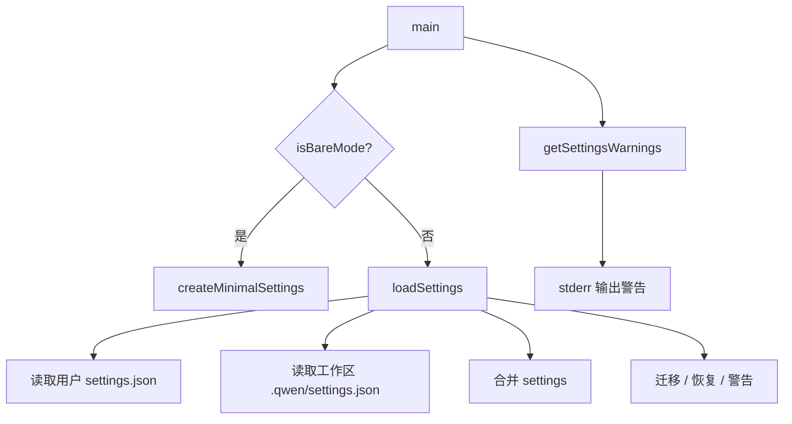
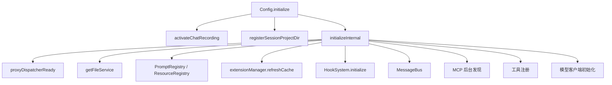
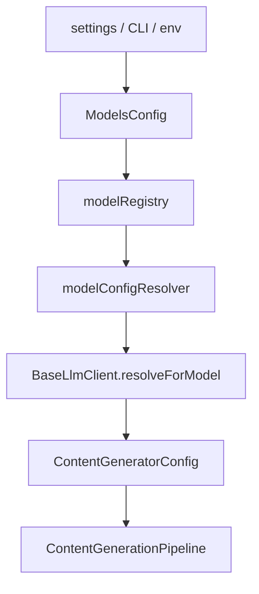
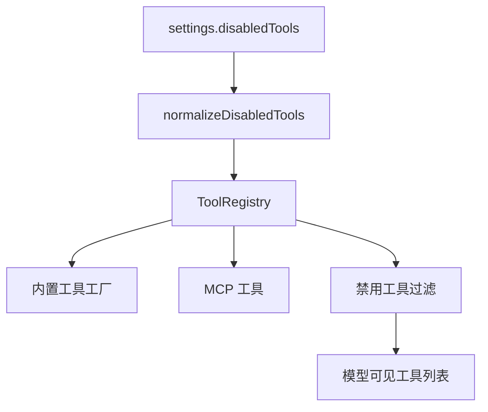
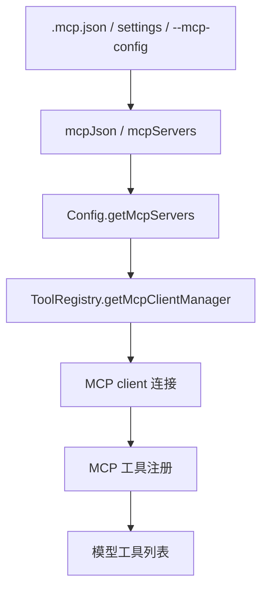
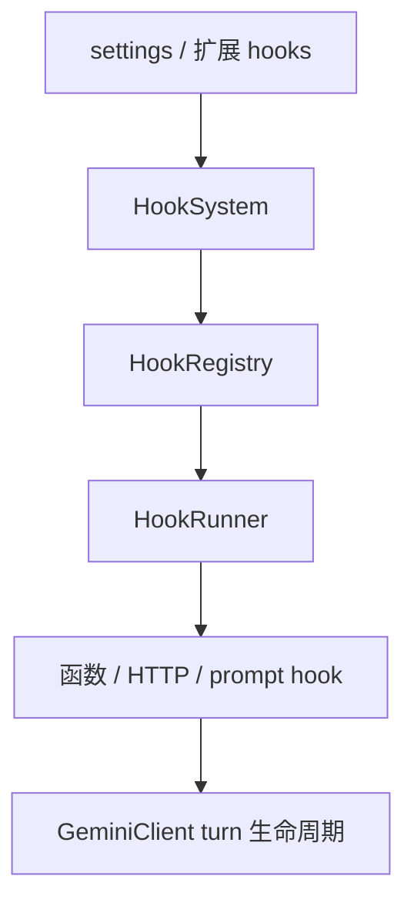
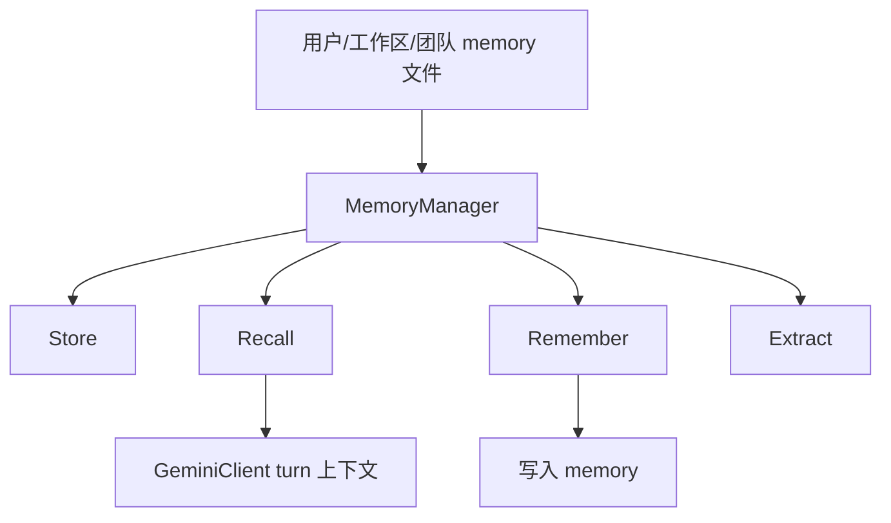
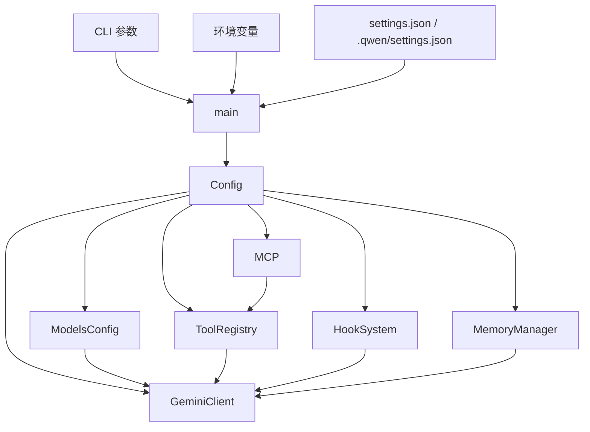

[上一篇：05-API与接口设计](05-API与接口设计.md) · [总目录](README.md) · [下一篇：07-工具执行与权限](07-工具执行与权限.md)

# 配置与数据流

> **场景**：补齐 settings、config、环境变量、模型配置、工具注册、MCP、hooks、memory 等配置来源与数据流，说明一次启动时配置如何进入核心引擎。
> **时间**：2026-08-21 CST。
> **工具版本**：仓库 `@qwen-code/qwen-code` 当前工作区版本 `0.21.14`；Node.js 要求 `>=22`。

> **阅读说明**：本文是第四层模块补齐文档。源码行号只用于定位，不视为稳定 API；当前工作区源码为权威。

---

## 本文件内容

1. [配置来源总览](#1-配置来源总览)
2. [settings 加载](#2-settings-加载)
3. [Config 初始化数据流](#3-config-初始化数据流)
4. [模型配置](#4-模型配置)
5. [工具注册与禁用](#5-工具注册与禁用)
6. [MCP 配置与发现](#6-mcp-配置与发现)
7. [hooks 配置与执行](#7-hooks-配置与执行)
8. [memory 数据流](#8-memory-数据流)
9. [配置数据流图](#9-配置数据流图)

其余阶段见[总目录](README.md)。

---

## 1. 配置来源总览

| 来源 | 说明 | 关键文件 |
| --- | --- | --- |
| CLI 参数 | `-p`、`--model`、`--auth-type`、`--bare`、`--acp` 等 | `packages/cli/src/gemini.tsx`、`packages/cli/src/cli.ts` |
| 用户 settings | 用户级 `settings.json` | `packages/cli/src/config/settings.ts` |
| 工作区 settings | 工作区 `.qwen/settings.json` | `packages/cli/src/config/settings.ts` |
| 环境变量 | `QWEN_CODE_*`、`SANDBOX`、`DEV` 等 | `packages/cli/src/config/environment.ts`、`shared-env-keys.ts` |
| 模型配置 | provider/model 配置 | `packages/core/src/config/models.ts`、`packages/core/src/models/*` |
| MCP 配置 | `.mcp.json`、settings、CLI `--mcp-config` | `packages/cli/src/config/mcpJson.ts`、`mcpServers.ts` |
| hooks | settings 与扩展 hooks | `packages/core/src/hooks/*` |
| memory | 用户/工作区/团队 memory | `packages/core/src/memory/*` |

---

## 2. settings 加载

### 2.1 谁调用谁

`main()` 在参数解析后调用 `loadSettings()` 或 `createMinimalSettings()`。

### 2.2 数据流

### 2.3 源码索引

| 动作 | 源码 |
| --- | --- |
| settings 加载 | `packages/cli/src/gemini.tsx, 第 420-440 行附近` |
| settings 实现 | `packages/cli/src/config/settings.ts` |
| settings schema | `packages/cli/src/config/settingsSchema.ts` |
| 环境变量 | `packages/cli/src/config/environment.ts` |

---

## 3. Config 初始化数据流

### 3.1 谁调用谁

`main()` 创建 `Config` 后调用 `initializeApp`，`initializeApp` 内部依赖 `Config.initialize`。

### 3.2 数据流

### 3.3 源码索引

| 动作 | 源码 |
| --- | --- |
| `Config.initialize` | `packages/core/src/config/config.ts, 第 2641 行` |
| `initializeOnce` | `packages/core/src/config/config.ts, 第 2659 行` |
| `initializeInternal` | `packages/core/src/config/config.ts, 第 2698 行` |
| `getModelsConfig` | `packages/core/src/config/config.ts, 第 3724 行` |
| `getToolRegistry` | `packages/core/src/config/config.ts, 第 5289 行` |
| `getMcpServers` | `packages/core/src/config/config.ts, 第 5737 行` |
| `getHookSystem` | `packages/core/src/config/config.ts, 第 7235 行` |
| `getMemoryManager` | `packages/core/src/config/config.ts, 第 7368 行` |

---

## 4. 模型配置

### 4.1 设计初衷

模型配置需要支持多 provider、多模型、认证类型、fallback、采样参数、上下文窗口等。核心由 `ModelsConfig` 和 `BaseLlmClient` 解析。

### 4.2 关键文件

| 文件 | 说明 |
| --- | --- |
| `packages/core/src/config/models.ts` | 模型配置类型与解析 |
| `packages/core/src/models/modelsConfig.ts` | `ModelsConfig` |
| `packages/core/src/models/modelRegistry.ts` | 模型注册表 |
| `packages/core/src/models/modelConfigResolver.ts` | 模型配置解析 |
| `packages/core/src/models/content-generator-config.ts` | 内容生成配置 |
| `packages/core/src/providers/*` | provider 预设与安装 |

### 4.3 数据流

---

## 5. 工具注册与禁用

### 5.1 谁调用谁

`Config.initializeInternal` 初始化 `ToolRegistry`，注册内置工具、MCP 工具，并应用禁用工具配置。

### 5.2 关键文件

| 文件 | 说明 |
| --- | --- |
| `packages/core/src/tools/tool-registry.ts` | 工具注册表 |
| `packages/cli/src/config/normalizeDisabledTools.ts` | 禁用工具规范化 |
| `packages/core/src/tools/*` | 内置工具实现 |

### 5.3 数据流

---

## 6. MCP 配置与发现

### 6.1 谁调用谁

`Config` 在初始化时读取 MCP 配置，`ToolRegistry` 通过 MCP client manager 注册 MCP 工具。

### 6.2 关键文件

| 文件 | 说明 |
| --- | --- |
| `packages/cli/src/config/mcpJson.ts` | `.mcp.json` 解析 |
| `packages/cli/src/config/mcpServers.ts` | MCP server 配置 |
| `packages/cli/src/config/mcpApprovals.ts` | MCP 审批 |
| `packages/core/src/mcp/*` | MCP client、OAuth、token storage |
| `packages/core/src/tools/mcp-*` | MCP 工具适配 |

### 6.3 数据流

---

## 7. hooks 配置与执行

### 7.1 谁调用谁

`Config.initializeInternal` 创建 `HookSystem` 并初始化。`GeminiClient` 在 turn 生命周期中触发 hooks。

### 7.2 关键文件

| 文件 | 说明 |
| --- | --- |
| `packages/core/src/hooks/hookSystem.ts` | hook 系统 |
| `packages/core/src/hooks/hookRegistry.ts` | hook 注册 |
| `packages/core/src/hooks/hookRunner.ts` | hook 执行 |
| `packages/core/src/hooks/functionHookRunner.ts` | 函数 hook |
| `packages/core/src/hooks/httpHookRunner.ts` | HTTP hook |
| `packages/core/src/hooks/promptHookRunner.ts` | prompt hook |
| `packages/core/src/hooks/sessionHooksManager.ts` | 会话 hook |
| `packages/core/src/hooks/types.ts` | hook 类型 |

### 7.3 数据流

---

## 8. memory 数据流

### 8.1 谁调用谁

`Config.getMemoryManager()` 提供 memory 管理。`GeminiClient` 在 turn 前可能进行 memory prefetch/recall。

### 8.2 关键文件

| 文件 | 说明 |
| --- | --- |
| `packages/core/src/memory/manager.ts` | memory manager |
| `packages/core/src/memory/store.ts` | memory store |
| `packages/core/src/memory/recall.ts` | memory recall |
| `packages/core/src/memory/remember.ts` | memory remember |
| `packages/core/src/memory/extract.ts` | memory 提取 |
| `packages/core/src/memory/prompt.ts` | memory prompt |
| `packages/core/src/memory/paths.ts` | memory 路径 |
| `packages/core/src/memory/scopes.ts` | memory scope |
| `packages/core/src/memory/team-memory-sync.ts` | 团队 memory 同步 |

### 8.3 数据流

---

## 9. 配置数据流图

---

[上一篇：05-API与接口设计](05-API与接口设计.md) · [总目录](README.md) · [下一篇：07-工具执行与权限](07-工具执行与权限.md)
