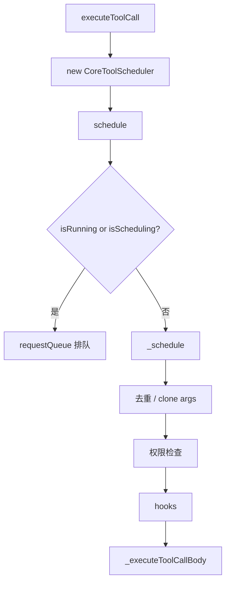
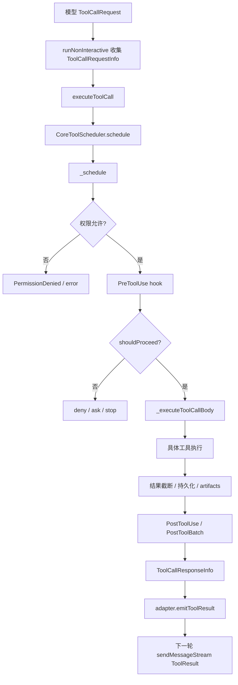

[上一篇：06-配置与数据流](06-配置与数据流.md) · [总目录](README.md) · [下一篇：08-ACP桥与会话生命周期](08-ACP桥与会话生命周期.md)

# 工具执行与权限

> **场景**：补齐工具注册、调度、权限、hooks、批处理、截断、错误传播等逻辑，说明模型请求工具后系统如何安全执行并回传结果。
> **时间**：2026-08-21 CST。
> **工具版本**：仓库 `@qwen-code/qwen-code` 当前工作区版本 `0.21.14`；Node.js 要求 `>=22`。

> **阅读说明**：本文是第四层模块补齐文档。源码行号只用于定位，不视为稳定 API；当前工作区源码为权威。

---

## 本文件内容

1. [工具系统总览](#1-工具系统总览)
2. [ToolRegistry](#2-toolregistry)
3. [CoreToolScheduler 调度入口](#3-coretoolscheduler-调度入口)
4. [权限与 ApprovalMode](#4-权限与-approvalmode)
5. [hooks 与工具生命周期](#5-hooks-与工具生命周期)
6. [工具执行与结果处理](#6-工具执行与结果处理)
7. [内置工具分类](#7-内置工具分类)
8. [工具执行流程图](#8-工具执行流程图)

其余阶段见[总目录](README.md)。

---

## 1. 工具系统总览

工具系统由三层组成：

| 层 | 文件 | 职责 |
| --- | --- | --- |
| 注册层 | `packages/core/src/tools/tool-registry.ts` | 注册内置工具、MCP 工具、禁用工具 |
| 调度层 | `packages/core/src/core/coreToolScheduler.ts` | 权限、hooks、执行、批处理、截断、错误传播 |
| 实现层 | `packages/core/src/tools/*` | 具体工具实现 |

---

## 2. ToolRegistry

### 2.1 设计初衷

工具数量多，且 MCP 工具需要动态发现。`ToolRegistry` 用 `ToolFactory` 懒加载工具，避免启动时加载所有工具。

### 2.2 关键类型

```ts
export type ToolFactory = () => Promise<AnyDeclarativeTool>;
```

### 2.3 关键职责

- 注册内置工具。
- 注册 MCP 工具。
- 应用禁用工具配置。
- 查询和过滤工具。
- 提供 MCP client manager。

### 2.4 源码索引

| 动作 | 源码 |
| --- | --- |
| `ToolFactory` | `packages/core/src/tools/tool-registry.ts, 第 36 行` |
| `ToolRegistry` | `packages/core/src/tools/tool-registry.ts, 第 195 行` |

---

## 3. CoreToolScheduler 调度入口

### 3.1 谁调用谁

非交互模式通过 `packages/core/src/core/nonInteractiveToolExecutor.ts` 的 `executeToolCall` 创建 `CoreToolScheduler` 并调用 `schedule`。

### 3.2 调度入口



### 3.3 源码索引

| 动作 | 源码 |
| --- | --- |
| `executeToolCall` | `packages/core/src/core/nonInteractiveToolExecutor.ts, 第 33-70 行` |
| `schedule` | `packages/core/src/core/coreToolScheduler.ts, 第 2209-2244 行` |
| `_schedule` | `packages/core/src/core/coreToolScheduler.ts, 第 2297 行起` |
| `_executeToolCallBody` | `packages/core/src/core/coreToolScheduler.ts, 第 4423 行起` |

---

## 4. 权限与 ApprovalMode

### 4.1 设计初衷

工具可能修改文件、执行 Shell、访问网络。权限系统根据 `ApprovalMode`、权限规则、hooks、auto mode 决定是否执行。

### 4.2 关键逻辑

- `_schedule` 先检查工具是否被权限/环境排除。
- 根据 `config.getApprovalMode()` 判断：
  - `AUTO`：自动批准允许的工具。
  - `PLAN`：计划模式，阻止非计划工具。
  - 其他模式：进入手动审批或 auto mode fallback。
- `ToolConfirmationOutcome` 表示确认结果，如 `ProceedAlways`、`Cancel` 等。

### 4.3 源码索引

| 动作 | 源码 |
| --- | --- |
| 权限检查 | `packages/core/src/core/coreToolScheduler.ts, 第 2418-2500 行附近` |
| ApprovalMode 决策 | `packages/core/src/core/coreToolScheduler.ts, 第 2722-3200 行附近` |
| auto mode | `packages/core/src/permissions/autoMode.ts` |
| permission flow | `packages/core/src/core/permissionFlow.ts` |
| permission helpers | `packages/core/src/core/permission-helpers.ts` |

---

## 5. hooks 与工具生命周期

### 5.1 设计初衷

hooks 允许在工具执行前后插入审计、审批、修改输入、停止执行等逻辑。

### 5.2 关键 hook 事件

| hook | 说明 |
| --- | --- |
| `PreToolUse` | 工具执行前 |
| `PostToolUse` | 工具执行后 |
| `PostToolUseFailure` | 工具执行失败后 |
| `PostToolBatch` | 工具批处理完成后 |
| `PermissionDenied` | 权限拒绝时 |

### 5.3 源码索引

| 动作 | 源码 |
| --- | --- |
| PreToolUse hook | `packages/core/src/core/coreToolScheduler.ts, 第 4500-4700 行附近` |
| PostToolBatch | `packages/core/src/core/coreToolScheduler.ts, 第 1000-1200 行附近` |
| hook 类型 | `packages/core/src/hooks/types.ts` |
| hook 执行 | `packages/core/src/hooks/hookRunner.ts`、`functionHookRunner.ts`、`httpHookRunner.ts` |

---

## 6. 工具执行与结果处理

### 6.1 执行流程

- `_executeToolCallBody` 规范化路径参数。
- 生成 `tool_use_id` 用于 hook 关联。
- 执行 PreToolUse hook。
- 执行具体工具。
- 处理结果：
  - 截断超长输出。
  - 持久化大结果到文件。
  - 记录 artifacts。
  - 生成 `responseParts`。
- 执行 PostToolUse / PostToolUseFailure / PostToolBatch hooks。

### 6.2 关键结果字段

| 字段 | 说明 |
| --- | --- |
| `responseParts` | 回传模型的 `functionResponse` parts |
| `resultDisplay` | 展示给用户的结果 |
| `error` | 错误对象 |
| `errorType` | 错误类型 |
| `executionStatus` | 执行状态，如 `not_started`、`success`、`error` |
| `persistedOutputFiles` | 持久化输出文件 |
| `artifacts` | artifacts |

### 6.3 源码索引

| 动作 | 源码 |
| --- | --- |
| 结果截断 | `packages/core/src/core/coreToolScheduler.ts` 中 `truncateToolOutput` 相关 |
| 结果持久化 | `packages/core/src/core/coreToolScheduler.ts` 中 `persistedOutputFiles` 相关 |
| 错误处理 | `packages/core/src/tools/tool-error.ts` |

---

## 7. 内置工具分类

| 分类 | 文件 | 说明 |
| --- | --- | --- |
| 文件读取 | `read-file.ts` | 读取文件 |
| 文件写入 | `write-file.ts` | 写文件 |
| 编辑 | `edit.ts` | 编辑文件 |
| Shell | `shell.ts` | 执行 Shell 命令 |
| 搜索 | `grep.ts`、`glob.ts`、`ripGrep.ts` | 搜索文件/内容 |
| 目录 | `ls.ts` | 列出目录 |
| LSP | `lsp.ts` | LSP 操作 |
| MCP | `mcp-client.ts`、`mcp-tool.ts`、`mcp-client-manager.ts` | MCP 工具 |
| Agent | `agent/agent.ts`、`agent/fork-subagent.ts` | 子 agent |
| Workflow | `workflow/workflow.ts` | 工作流 |
| 任务 | `task-create.ts`、`task-list.ts`、`task-stop.ts`、`task-update.ts` | 任务管理 |
| 团队 | `team-create.ts`、`team-delete.ts`、`team-lifecycle.ts`、`team-plan-approval.ts` | 团队协作 |
| 计划模式 | `enterPlanMode.ts`、`exitPlanMode.ts` | 计划模式 |
| 工作树 | `enter-worktree.ts`、`exit-worktree.ts` | 工作树 |
| 技能 | `skill.ts`、`skill-utils.ts` | 技能 |
| 记忆 | `memory-config.ts` | memory 配置 |
| 网络 | `web-fetch.ts`、`web-search.ts` | 网络访问 |
| 图片 | `display-image.ts`、`image-gen.ts`、`zoom-image.ts` | 图片 |
| 定时任务 | `cron-create.ts`、`cron-list.ts`、`cron-delete.ts` | 定时任务 |
| 结构化输出 | `syntheticOutput.ts` | 结构化输出 |
| 用户提问 | `askUserQuestion.ts` | 向用户提问 |
| 子会话 | `create-sub-session.ts` | 创建子会话 |
| 监控 | `monitor.ts` | 监控 |
| 发送消息 | `send-message.ts` | 发送消息 |
| 记录 artifact | `record-artifact.ts` | 记录 artifact |
| 工具搜索 | `tool-search.ts` | 搜索工具 |
| 循环唤醒 | `loop-wakeup.ts` | 循环唤醒 |
| 计算机使用 | `computer-use/*` | 计算机使用 |

---

## 8. 工具执行流程图



---

[上一篇：06-配置与数据流](06-配置与数据流.md) · [总目录](README.md) · [下一篇：08-ACP桥与会话生命周期](08-ACP桥与会话生命周期.md)
