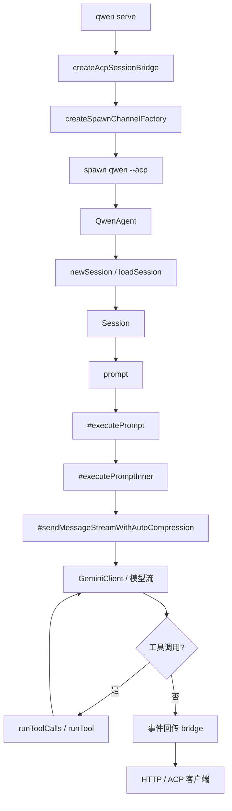

[上一篇：07-工具执行与权限](07-工具执行与权限.md) · [总目录](README.md) · [下一篇：09-服务端daemon与路由](09-服务端daemon与路由.md)

# ACP 桥与会话生命周期

> **场景**：补齐 daemon 与 `qwen --acp` 子进程之间的 ACP 桥、NDJSON 传输、权限、事件、会话创建/恢复/prompt/cancel 等生命周期逻辑。
> **时间**：2026-08-21 CST。
> **工具版本**：仓库 `@qwen-code/qwen-code` 当前工作区版本 `0.21.14`；Node.js 要求 `>=22`。

> **阅读说明**：本文是第四层模块补齐文档。源码行号只用于定位，不视为稳定 API；当前工作区源码为权威。

---

## 本文件内容

1. [ACP 桥总览](#1-acp-桥总览)
2. [AcpChannel 与 NDJSON 传输](#2-acpchannel-与-ndjson-传输)
3. [spawnChannel](#3-spawnchannel)
4. [BridgeClient](#4-bridgeclient)
5. [createAcpSessionBridge](#5-createacpsessionbridge)
6. [QwenAgent](#6-qwenagent)
7. [Session](#7-session)
8. [会话生命周期图](#8-会话生命周期图)

其余阶段见[总目录](README.md)。

---

## 1. ACP 桥总览

ACP 桥连接两类进程：

| 进程 | 角色 | 关键文件 |
| --- | --- | --- |
| daemon | 宿主，管理会话、权限、事件、HTTP/ACP 客户端 | `packages/cli/src/serve/*`、`packages/acp-bridge/src/*` |
| `qwen --acp` | ACP agent 子进程，实际执行会话 prompt | `packages/cli/src/acp-integration/acpAgent.ts` |

数据通过 NDJSON channel 传输，权限和事件由 bridge 转发。

---

## 2. AcpChannel 与 NDJSON 传输

### 2.1 `AcpChannel`

`packages/acp-bridge/src/channel.ts, 第 28 行` 定义 channel 接口，包含：

- 发送/接收消息。
- 关闭。
- 退出信息。
- transport guard。

### 2.2 `ndJsonStream`

`packages/acp-bridge/src/ndJsonStream.ts` 实现有界 NDJSON 传输：

- 帧大小限制。
- 队列限制。
- JSON-RPC 校验。
- 防止无限内存增长。

### 2.3 源码索引

| 动作 | 源码 |
| --- | --- |
| `AcpChannel` | `packages/acp-bridge/src/channel.ts, 第 28 行` |
| `AcpChannelTransportGuard` | `packages/acp-bridge/src/channel.ts, 第 9 行` |
| NDJSON 流 | `packages/acp-bridge/src/ndJsonStream.ts` |

---

## 3. spawnChannel

### 3.1 谁调用谁

`createAcpSessionBridge` 使用 `createSpawnChannelFactory` 创建 channel，spawn `qwen --acp` 子进程。

### 3.2 关键逻辑

- 清理环境变量，避免敏感信息泄漏。
- 设置子进程 heap policy。
- 建立 NDJSON channel。
- 处理子进程退出。

### 3.3 源码索引

| 动作 | 源码 |
| --- | --- |
| `createSpawnChannelFactory` | `packages/acp-bridge/src/spawnChannel.ts, 第 432 行` |
| 默认工厂 | `packages/acp-bridge/src/spawnChannel.ts, 第 623-628 行` |
| child heap policy | `packages/acp-bridge/src/child-heap-policy.ts` |

---

## 4. BridgeClient

### 4.1 谁调用谁

daemon 通过 `BridgeClient` 与 ACP agent 通信。

### 4.2 关键方法

| 方法 | 说明 |
| --- | --- |
| `requestPermission` | 请求权限 |
| `sessionUpdate` | 更新会话 |
| `extMethod` | 调用扩展方法 |
| `extNotification` | 发送扩展通知 |
| 文件系统代理 | 代理文件操作 |
| early events | 早期事件处理 |

### 4.3 源码索引

| 动作 | 源码 |
| --- | --- |
| `BridgeClient` | `packages/acp-bridge/src/bridgeClient.ts, 第 693 行` |

---

## 5. createAcpSessionBridge

### 5.1 谁调用谁

`qwen serve` 创建 daemon 后调用 `createAcpSessionBridge`。

### 5.2 关键职责

- channel 生命周期。
- session spawn/restore。
- prompt queue。
- permissions。
- events。
- shutdown。

### 5.3 源码索引

| 动作 | 源码 |
| --- | --- |
| `createAcpSessionBridge` | `packages/acp-bridge/src/bridge.ts, 第 2503 行起` |
| bridge 类型 | `packages/acp-bridge/src/bridgeTypes.ts` |
| bridge 错误 | `packages/acp-bridge/src/bridgeErrors.ts` |
| 权限 | `packages/acp-bridge/src/permission.ts`、`permissionMediator.ts` |
| 事件总线 | `packages/acp-bridge/src/eventBus.ts` |
| 会话恢复超时 | `packages/acp-bridge/src/session-restore-timeout.ts` |
| 会话来源 | `packages/acp-bridge/src/session-source.ts` |
| 会话 artifacts | `packages/acp-bridge/src/sessionArtifacts.ts` |
| 会话附件 | `packages/acp-bridge/src/sessionAttachments.ts` |

---

## 6. QwenAgent

### 6.1 谁调用谁

`qwen --acp` 子进程启动 `QwenAgent`，作为 ACP 服务端。

### 6.2 关键方法

| 方法 | 说明 |
| --- | --- |
| `newSession` | 创建新会话 |
| `loadSession` | 恢复已有会话 |
| `prompt` | 处理 prompt |
| `cancel` | 取消当前 prompt |
| `newSessionConfig` | 创建会话配置 |
| `createAndStoreSession` | 创建并存储会话 |

### 6.3 源码索引

| 动作 | 源码 |
| --- | --- |
| `QwenAgent.newSession` | `packages/cli/src/acp-integration/acpAgent.ts, 第 5191 行` |
| `QwenAgent.loadSession` | `packages/cli/src/acp-integration/acpAgent.ts, 第 5274 行` |
| `QwenAgent.prompt` | `packages/cli/src/acp-integration/acpAgent.ts, 第 6049 行` |
| `QwenAgent.cancel` | `packages/cli/src/acp-integration/acpAgent.ts, 第 6172 行` |

---

## 7. Session

### 7.1 谁调用谁

`QwenAgent` 创建/恢复 `Session`，`Session` 复用核心引擎执行 prompt。

### 7.2 关键方法

| 方法 | 说明 |
| --- | --- |
| `prompt` | 会话 prompt 入口 |
| `#executePrompt` | 执行 prompt 外层 |
| `#executePromptInner` | 执行 prompt 内层 |
| `#sendMessageStreamWithAutoCompression` | 发送消息并自动压缩 |
| `runToolCalls` | 批量执行工具调用 |
| `runTool` | 执行单个工具 |

### 7.3 队列与权限

- mid-turn queue：处理 turn 中队列。
- cron queue：定时任务队列。
- goal queue：Goal 队列。
- permission flow：权限请求与确认。

### 7.4 源码索引

| 动作 | 源码 |
| --- | --- |
| `Session` 类 | `packages/cli/src/acp-integration/session/Session.ts, 第 1757 行` |
| `prompt` | `packages/cli/src/acp-integration/session/Session.ts, 第 3705 行` |
| `#executePrompt` | `packages/cli/src/acp-integration/session/Session.ts, 第 4289 行` |
| `#executePromptInner` | `packages/cli/src/acp-integration/session/Session.ts, 第 4332 行` |
| `#sendMessageStreamWithAutoCompression` | `packages/cli/src/acp-integration/session/Session.ts, 第 6416 行` |
| `runToolCalls` | `packages/cli/src/acp-integration/session/Session.ts, 第 8872 行` |
| `runTool` | `packages/cli/src/acp-integration/session/Session.ts, 第 9554 行` |

---

## 8. 会话生命周期图

---

[上一篇：07-工具执行与权限](07-工具执行与权限.md) · [总目录](README.md) · [下一篇：09-服务端daemon与路由](09-服务端daemon与路由.md)
