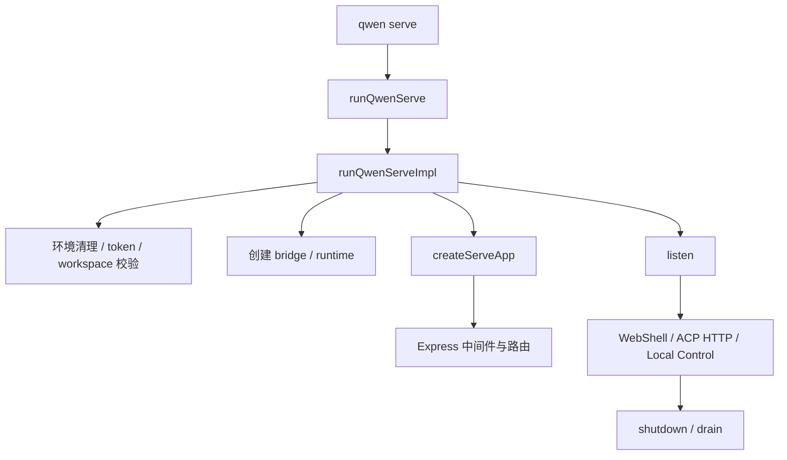
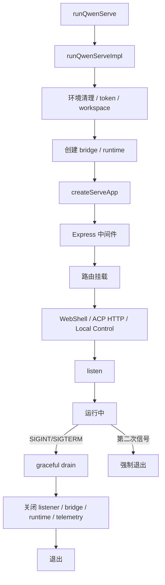

[上一篇：08-ACP桥与会话生命周期](08-ACP桥与会话生命周期.md) · [总目录](README.md) · [下一篇：10-模型与Provider](10-模型与Provider.md)

# 服务端 daemon 与路由

> **场景**：补齐 `qwen serve` 的 daemon 启动、Express 应用、中间件、WebShell、ACP HTTP、Local Control、scheduled tasks、drain 与 shutdown 逻辑。
> **时间**：2026-08-21 CST。
> **工具版本**：仓库 `@qwen-code/qwen-code` 当前工作区版本 `0.21.14`；Node.js 要求 `>=22`。

> **阅读说明**：本文是第四层模块补齐文档。源码行号只用于定位，不视为稳定 API；当前工作区源码为权威。

---

## 本文件内容

1. [daemon 启动总览](#1-daemon-启动总览)
2. [runQwenServe](#2-runqwenserve)
3. [createServeApp](#3-createserveapp)
4. [中间件与安全](#4-中间件与安全)
5. [路由分类](#5-路由分类)
6. [WebShell / ACP HTTP / Local Control](#6-webshell--acp-http--local-control)
7. [scheduled tasks 与 drain](#7-scheduled-tasks-与-drain)
8. [daemon 生命周期图](#8-daemon-生命周期图)

其余阶段见[总目录](README.md)。

---

## 1. daemon 启动总览

`qwen serve` 启动一个常驻 daemon，通过 HTTP/WebSocket/ACP 暴露会话、工具、文件、Git、设置、MCP、扩展等能力。daemon 内部会创建 ACP bridge，spawn `qwen --acp` 子进程执行实际会话。

---

## 2. runQwenServe

### 2.1 谁调用谁

`packages/cli/src/cli.ts` 的 `runCliEntry` 识别 `serve` 路由后，最终调用 `packages/cli/src/serve/run-qwen-serve.ts` 的 `runQwenServe`。

### 2.2 关键逻辑

- `runQwenServe` 包装 `runQwenServeImpl`，处理启动失败日志、loader env 恢复。
- `runQwenServeImpl` 清理 `EXTERNAL_TOOL_GUARD_TOKEN_ENV`。
- 校验 `memoryProjectScope`。
- 处理 token、session shell、loader env scrub。
- 创建 daemon runtime base env。
- 创建 bridge、runtime、Express app。
- 监听端口，处理 shutdown/drain。

### 2.3 源码索引

| 动作 | 源码 |
| --- | --- |
| `runQwenServe` | `packages/cli/src/serve/run-qwen-serve.ts, 第 2103 行` |
| `runQwenServeImpl` | `packages/cli/src/serve/run-qwen-serve.ts, 第 2153 行` |
| 环境清理 | `packages/cli/src/serve/run-qwen-serve.ts, 第 2160-2260 行附近` |
| listen | `packages/cli/src/serve/run-qwen-serve.ts, 第 7970-7972 行附近` |
| shutdown/drain | `packages/cli/src/serve/run-qwen-serve.ts, 第 7360-7725 行附近` |

---

## 3. createServeApp

### 3.1 谁调用谁

`runQwenServeImpl` 调用 `packages/cli/src/serve/server.ts` 的 `createServeApp`。

### 3.2 关键逻辑

- 创建 Express app。
- 安装 serve app lifecycle。
- 解析 workspace、fsFactory、token、session shell。
- 创建 client MCP sender registry。
- 挂载中间件和路由。
- 挂载 WebShell、ACP HTTP、Local Control、scheduled tasks。

### 3.3 源码索引

| 动作 | 源码 |
| --- | --- |
| `createServeApp` | `packages/cli/src/serve/server.ts, 第 710 行起` |
| Express app 创建 | `packages/cli/src/serve/server.ts, 第 740 行附近` |
| fsFactory / workspace | `packages/cli/src/serve/server.ts, 第 800-900 行附近` |

---

## 4. 中间件与安全

daemon 使用 Express 中间件处理：

- 认证 token。
- 请求体解析。
- 错误处理。
- 生命周期。
- 速率限制。
- 工作区信任。
- 文件系统信任边界。

### 4.1 源码索引

| 动作 | 源码 |
| --- | --- |
| serve app lifecycle | `packages/cli/src/serve/server.ts` 中 `installServeAppLifecycle` |
| 工作区信任 | `packages/cli/src/serve/routes/workspace-trust.ts` |
| 工作区认证 | `packages/cli/src/serve/routes/workspace-auth.ts` |
| 权限 | `packages/cli/src/serve/routes/permission.ts`、`workspace-permissions.ts` |

---

## 5. 路由分类

`packages/cli/src/serve/routes/` 下路由已在 `05-API与接口设计.md` 分类。daemon 路由覆盖：

- 健康/状态。
- 会话。
- 权限。
- 文件。
- Git/GitHub。
- 设置/模型/工具。
- MCP。
- 扩展。
- 技能。
- 语音。
- 生命周期。
- 本地控制。
- SSE 事件。
- 定时任务。
- 渠道。
- A2UI。
- 用量。
- 信任。
- 认证。
- Goal。
- 能力。
- 实时。

---

## 6. WebShell / ACP HTTP / Local Control

### 6.1 WebShell

WebShell 是 daemon 提供的 Web UI，挂载在 Express app 上，使用 `packages/web-shell` 构建产物。

### 6.2 ACP HTTP

`packages/cli/src/serve/acp-http/` 提供 ACP over HTTP/WebSocket 传输，包括：

- `client-mcp-sender-registry.ts`
- `client-mcp-ws.ts`

### 6.3 Local Control

`packages/cli/src/serve/routes/workspace-local-control.ts` 提供本地控制能力。

### 6.4 源码索引

| 动作 | 源码 |
| --- | --- |
| WebShell 挂载 | `packages/cli/src/serve/server.ts` 中 WebShell 相关 |
| ACP HTTP | `packages/cli/src/serve/acp-http/*` |
| Local Control | `packages/cli/src/serve/routes/workspace-local-control.ts` |

---

## 7. scheduled tasks 与 drain

### 7.1 scheduled tasks

`packages/cli/src/serve/routes/scheduled-tasks.ts` 管理定时任务。daemon 在启动和关闭时处理 scheduled task restore/drain。

### 7.2 drain 与 shutdown

- 第一次信号触发 graceful drain。
- 第二次信号强制退出。
- 关闭 listener、bridge、workspace runtime、channel worker、telemetry。
- 处理 workspace scheduled-task drain rollback。

### 7.3 源码索引

| 动作 | 源码 |
| --- | --- |
| scheduled tasks 路由 | `packages/cli/src/serve/routes/scheduled-tasks.ts` |
| drain/shutdown | `packages/cli/src/serve/run-qwen-serve.ts, 第 7360-7725 行附近` |

---

## 8. daemon 生命周期图

---

[上一篇：08-ACP桥与会话生命周期](08-ACP桥与会话生命周期.md) · [总目录](README.md) · [下一篇：10-模型与Provider](10-模型与Provider.md)
