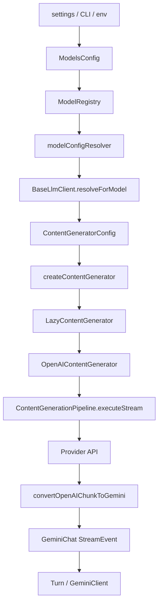

[上一篇：09-服务端daemon与路由](09-服务端daemon与路由.md) · [总目录](README.md) · [下一篇：11-测试构建部署](11-测试构建部署.md)

# 模型与 Provider

> **场景**：补齐模型配置、provider 预设、模型解析、OpenAI 兼容流、重试、fallback、token 恢复、transport continuation 等逻辑。
> **时间**：2026-08-21 CST。
> **工具版本**：仓库 `@qwen-code/qwen-code` 当前工作区版本 `0.21.14`；Node.js 要求 `>=22`。

> **阅读说明**：本文是第四层模块补齐文档。源码行号只用于定位，不视为稳定 API；当前工作区源码为权威。

---

## 本文件内容

1. [模型与 Provider 总览](#1-模型与-provider-总览)
2. [ModelsConfig 与 ModelRegistry](#2-modelsconfig-与-modelregistry)
3. [BaseLlmClient 模型解析](#3-basellmclient-模型解析)
4. [ContentGenerator 抽象](#4-contentgenerator-抽象)
5. [OpenAI 兼容流](#5-openai-兼容流)
6. [重试与 fallback](#6-重试与-fallback)
7. [token 恢复与 transport continuation](#7-token-恢复与-transport-continuation)
8. [模型数据流图](#8-模型数据流图)

其余阶段见[总目录](README.md)。

---

## 1. 模型与 Provider 总览

模型层负责：

- 解析用户选择的 provider/model。
- 生成内容生成配置。
- 创建 OpenAI 兼容内容生成器。
- 执行流式请求。
- 转换 chunk 为内部 `GenerateContentResponse` 风格事件。
- 处理重试、fallback、token 恢复、transport continuation。

---

## 2. ModelsConfig 与 ModelRegistry

### 2.1 设计初衷

`ModelsConfig` 聚合模型配置，`ModelRegistry` 维护模型注册表，`modelConfigResolver` 解析具体模型配置。

### 2.2 关键文件

| 文件 | 说明 |
| --- | --- |
| `packages/core/src/models/modelsConfig.ts, 第 81 行` | `ModelsConfig` |
| `packages/core/src/models/modelRegistry.ts, 第 86 行` | `ModelRegistry` |
| `packages/core/src/models/modelConfigResolver.ts` | 模型配置解析 |
| `packages/core/src/models/content-generator-config.ts` | 内容生成配置 |
| `packages/core/src/models/types.ts` | 模型类型 |
| `packages/core/src/config/models.ts` | 模型配置类型 |

---

## 3. BaseLlmClient 模型解析

### 3.1 谁调用谁

`GeminiChat` 调用 `BaseLlmClient.resolveForModel(model, options)` 解析模型路由。

### 3.2 关键逻辑

- 根据模型名查找 provider 和 content generator config。
- 支持 `failClosed`。
- 返回 `model`、`contentGeneratorConfig`、`retryAuthType`、`retryErrorCodes` 等。

### 3.3 源码索引

| 动作 | 源码 |
| --- | --- |
| `BaseLlmClient` | `packages/core/src/core/baseLlmClient.ts, 第 209 行` |
| `resolveForModel` | `packages/core/src/core/baseLlmClient.ts, 第 552 行` |
| `createContentGenerator` 调用 | `packages/core/src/core/baseLlmClient.ts, 第 747 行附近` |

---

## 4. ContentGenerator 抽象

### 4.1 设计初衷

不同 provider 可能有不同协议。`ContentGenerator` 抽象模型协议，`LazyContentGenerator` 延迟创建具体实现。

### 4.2 关键文件

| 文件 | 说明 |
| --- | --- |
| `packages/core/src/core/contentGenerator.ts, 第 359 行` | `createContentGeneratorConfig` |
| `packages/core/src/core/contentGenerator.ts, 第 402 行` | `LazyContentGenerator` |
| `packages/core/src/core/contentGenerator.ts, 第 489 行` | `createContentGenerator` |
| `packages/core/src/core/openaiContentGenerator/openaiContentGenerator.ts, 第 23 行` | `OpenAIContentGenerator` |

---

## 5. OpenAI 兼容流

### 5.1 谁调用谁

`GeminiChat` 通过 `ContentGenerationPipeline.executeStream` 执行 OpenAI 兼容流。

### 5.2 关键逻辑

- 执行流式请求。
- 处理 SSE/JSON chunk。
- 调用 `convertOpenAIChunkToGemini` 转换 chunk。
- 处理 reasoning、tool-call、thinking-tag。

### 5.3 源码索引

| 动作 | 源码 |
| --- | --- |
| `ContentGenerationPipeline` | `packages/core/src/core/openaiContentGenerator/pipeline.ts, 第 532 行` |
| `executeStream` | `packages/core/src/core/openaiContentGenerator/pipeline.ts, 第 592 行起` |
| `convertOpenAIChunkToGemini` | `packages/core/src/core/openaiContentGenerator/converter.ts, 第 1347 行` |

---

## 6. 重试与 fallback

### 6.1 设计初衷

模型请求可能遇到 429、503、529、网络中断、MAX_TOKENS 等。`GeminiChat` 需要重试、fallback、token 恢复。

### 6.2 关键逻辑

- `retryWithBackoff` 处理可重试错误。
- `model_fallback` 事件表示切换到 fallback 模型。
- `MAX_TOKENS` 时尝试提升 max output tokens。
- transport stream retry 处理 socket 中断后的 continuation。

### 6.3 源码索引

| 动作 | 源码 |
| --- | --- |
| 重试工具 | `packages/core/src/utils/retry.ts` |
| 错误分类 | `packages/core/src/utils/retryErrorClassification.ts` |
| fallback 事件 | `packages/core/src/core/geminiChat.ts, 第 406-430 行附近` |
| 重试/fallback 主逻辑 | `packages/core/src/core/geminiChat.ts, 第 2736-2800 行附近` |

---

## 7. token 恢复与 transport continuation

### 7.1 设计初衷

当模型输出达到 `MAX_TOKENS` 或流被 socket 中断时，需要恢复输出，避免丢失已生成内容。

### 7.2 关键逻辑

- `clampOutputTokensToWindow` 保证 `prompt + max_tokens ≤ window`。
- `OUTPUT_RECOVERY_MESSAGE` 指示模型继续输出。
- `transportContinuationText` 累积已交付文本。
- `transportContinuationPrefix` 用于去重 continuation 前缀。
- `processStreamResponse` 处理流响应。

### 7.3 源码索引

| 动作 | 源码 |
| --- | --- |
| token clamp | `packages/core/src/core/geminiChat.ts, 第 2641-2683 行附近` |
| transport continuation | `packages/core/src/core/geminiChat.ts, 第 2736-2760 行附近` |
| `processStreamResponse` | `packages/core/src/core/geminiChat.ts` |

---

## 8. 模型数据流图

---

[上一篇：09-服务端daemon与路由](09-服务端daemon与路由.md) · [总目录](README.md) · [下一篇：11-测试构建部署](11-测试构建部署.md)
