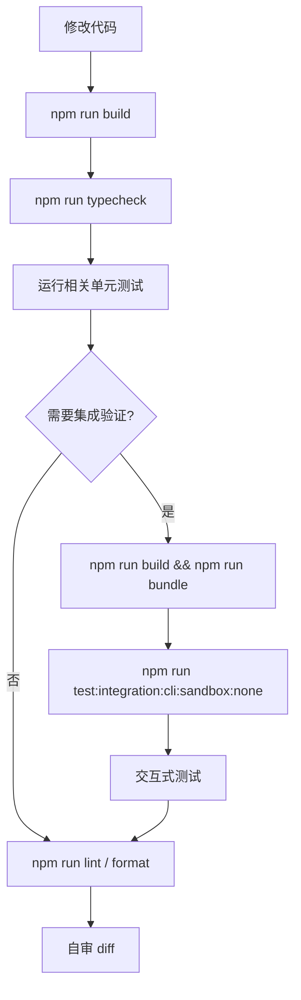

[上一篇：10-模型与Provider](10-模型与Provider.md) · [总目录](README.md) · [下一篇：README](README.md)

# 测试、构建与部署

> **场景**：补齐构建、bundle、开发运行、单元测试、集成测试、lint/format/typecheck、部署与运行约束，帮助开发者复现和验证。
> **时间**：2026-08-21 CST。
> **工具版本**：仓库 `@qwen-code/qwen-code` 当前工作区版本 `0.21.14`；Node.js 要求 `>=22`。

> **阅读说明**：本文是第四层模块补齐文档。命令以仓库根目录 `package.json` 和 `AGENTS.md` 为准；源码行号只用于定位，不视为稳定 API。

---

## 本文件内容

1. [构建命令](#1-构建命令)
2. [开发运行](#2-开发运行)
3. [单元测试](#3-单元测试)
4. [集成测试](#4-集成测试)
5. [lint / format / typecheck](#5-lint--format--typecheck)
6. [部署与运行约束](#6-部署与运行约束)
7. [验证流程图](#7-验证流程图)

其余阶段见[总目录](README.md)。

---

## 1. 构建命令

| 命令 | 说明 |
| --- | --- |
| `npm install` | 安装依赖；`prepare` 脚本会执行构建准备 |
| `npm run build` | 构建所有包，TypeScript 编译 + asset 复制 |
| `npm run build:all` | 构建所有内容，包括 sandbox container |
| `npm run bundle` | 将 `dist/` 打包为单个 `dist/cli.js`，需要先 build |
| `npm run build:packages` | 只构建 workspaces |
| `npm run build:sandbox` | 构建 sandbox |
| `npm run build:vscode` | 构建 VSCode companion |

### 1.1 源码索引

| 动作 | 源码 |
| --- | --- |
| 根脚本 | `package.json` 的 `scripts` |
| 构建脚本 | `scripts/build.js` |
| bundle 脚本 | `esbuild.config.js`、`scripts/copy_bundle_assets.js` |
| sandbox 构建 | `scripts/build_sandbox.js` |

---

## 2. 开发运行

| 命令 | 说明 |
| --- | --- |
| `npm run dev` | 通过 `tsx` 直接运行 CLI，`DEV=true`，无需 build |
| `npm run dev:daemon` | 开发运行 daemon |
| `npm run debug` | 带 `--inspect-brk` 调试 |
| `npm run start` | 运行 `scripts/start.js` |

### 2.1 源码索引

| 动作 | 源码 |
| --- | --- |
| dev 脚本 | `scripts/dev.js` |
| daemon dev | `scripts/daemon-dev.js` |
| start 脚本 | `scripts/start.js` |

---

## 3. 单元测试

### 3.1 规则

- 必须从具体包目录运行，不能从项目根目录直接运行 `npx vitest`。
- 优先运行单个测试文件。
- 更新快照使用 `--update`。
- 避免 `npm run test -- --filter=...`，它不会过滤。

### 3.2 命令

```bash
cd packages/core && npx vitest run src/path/to/file.test.ts
cd packages/cli && npx vitest run src/path/to/file.test.ts
cd packages/cli && npx vitest run src/path/to/file.test.ts --update
```

### 3.3 测试配置

| 包 | 配置 |
| --- | --- |
| core | `packages/core/vitest.config.ts` |
| cli | `packages/cli/vitest.config.ts` |
| acp-bridge | `packages/acp-bridge/vitest.config.ts` |

### 3.4 测试 gotcha

- CLI 测试中，`vi.mock()` 使用的 mock 要在 `vi.hoisted()` 中定义，因为 mock factory 在模块加载时执行。

---

## 4. 集成测试

### 4.1 前置

先构建 bundle：

```bash
npm run build && npm run bundle
```

### 4.2 命令

```bash
npm run test:integration:cli:sandbox:none
npm run test:integration:interactive:sandbox:none
```

或：

```bash
cd integration-tests && \
  cross-env QWEN_SANDBOX=false npx vitest run cli interactive
```

### 4.3 关键 gotcha

- 交互式测试中，每次 `send` 之间调用 `session.idle()`，因为 ANSI 输出异步流式。

### 4.4 集成测试目录

| 目录/文件 | 说明 |
| --- | --- |
| `integration-tests/cli/*` | CLI 集成测试 |
| `integration-tests/interactive/*` | 交互式测试 |
| `integration-tests/sdk-typescript/*` | TypeScript SDK 测试 |
| `integration-tests/fake-openai-server.ts` | fake OpenAI server |
| `integration-tests/globalSetup.ts` | 全局 setup |
| `integration-tests/vitest.config.ts` | 集成测试配置 |

---

## 5. lint / format / typecheck

| 命令 | 说明 |
| --- | --- |
| `npm run lint` | ESLint 检查 |
| `npm run lint:fix` | 自动修复 lint |
| `npm run format` | Prettier 格式化 |
| `npm run typecheck` | TypeScript 类型检查 |
| `npm run preflight` | 完整检查：clean → install → format → lint → build → typecheck → test |

### 5.1 代码规范

- ESM 全仓库。
- TypeScript strict mode。
- Prettier：单引号、分号、尾逗号、2 空格、80 字符宽。
- ESLint：无 `any`、一致 type imports、包间无相对导入。
- 测试与源码同目录：`file.test.ts` 在 `file.ts` 旁。
- 文件命名：React 组件 `PascalCase.tsx`；`packages/core` 和 `packages/cli` 的 `.ts` 用 `kebab-case.ts`。

---

## 6. 部署与运行约束

| 约束 | 说明 |
| --- | --- |
| Node.js | 开发和生产都要求 `>=22` |
| ESM | 所有包 `"type": "module"` |
| 构建产物 | `dist/` 是 TS 编译输出，`dist/cli.js` 是 bundle 输出 |
| 环境变量 | `DEV=true` 用于开发；`QWEN_SANDBOX` 控制 sandbox；`QWEN_CODE_*` 控制多种行为 |
| 测试运行目录 | 单元测试从包目录运行，集成测试从根目录脚本运行 |
| 版本 | 当前工作区版本 `0.21.14` |

---

## 7. 验证流程图



---

[上一篇：10-模型与Provider](10-模型与Provider.md) · [总目录](README.md) · [下一篇：README](README.md)
