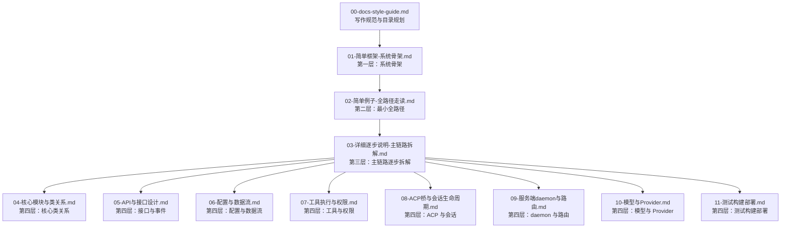

# docs/sourceReader 总目录

> **场景**：本目录是 `qwen-code` 的“新手重构级指南”文档库，按“简单框架 → 全路径例子 → 逐步详解 → 补齐全部逻辑”四层推进。
> **时间**：2026-08-21 CST。
> **工具版本**：仓库 `@qwen-code/qwen-code` 当前工作区版本 `0.21.14`；Node.js 要求 `>=22`；文档引用源码时以当前工作区源码为权威。

> **阅读说明**：源码行号只用于定位，不视为稳定 API。若本地已有后续修改，以当前源码为准。基础命令见仓库根目录 `AGENTS.md`，常用命令包括 `npm install`、`npm run build`、`npm run bundle`、`npm run dev`、`npm run typecheck`、`npm run lint`、`npm run format`。

---

## 文档分组

### 第一组：规范与骨架

定位：先建立写作规范，再建立系统骨架，让读者知道项目是什么、运行时有几块、请求大概怎么走。

| 顺序 | 文档 | 内容 |
| --- | --- | --- |
| 0 | [00-docs-style-guide.md](00-docs-style-guide.md) | 写作规范、四层推进顺序、目录规划、交付检查清单 |
| 1 | [01-简单框架-系统骨架.md](01-简单框架-系统骨架.md) | CLI、core、tools、ACP bridge、serve daemon、providers 的骨架与主数据流 |

### 第二组：全路径例子

定位：用一个真实最小例子走通主成功路径，让读者能跟读入口到返回。

| 顺序 | 文档 | 内容 |
| --- | --- | --- |
| 2 | [02-简单例子-全路径走读.md](02-简单例子-全路径走读.md) | `qwen -p "..."` 非交互 CLI 全路径，含 ASCII 流程与 Mermaid 时序图 |

### 第三组：主链路逐步拆解

定位：在全路径例子基础上，按调用顺序逐步拆开每一跳，讲清参数、返回值、错误传播和状态变化。

| 顺序 | 文档 | 内容 |
| --- | --- | --- |
| 3 | [03-详细逐步说明-主链路拆解.md](03-详细逐步说明-主链路拆解.md) | 从 CLI 入口到模型流、工具执行、输出适配器的逐步拆解 |

### 第四组：模块补齐

定位：补齐源码中的全部逻辑与技术点，达到可重新实现深度。

| 顺序 | 文档 | 内容 |
| --- | --- | --- |
| 4 | [04-核心模块与类关系.md](04-核心模块与类关系.md) | `Config`、`GeminiClient`、`Turn`、`GeminiChat`、`BaseLlmClient`、`ContentGenerator` 等核心类关系 |
| 5 | [05-API与接口设计.md](05-API与接口设计.md) | 包导出、核心接口、事件类型、工具接口、ACP 接口、HTTP 路由 |
| 6 | [06-配置与数据流.md](06-配置与数据流.md) | settings、config、环境变量、模型配置、工具注册、MCP、hooks、memory |
| 7 | [07-工具执行与权限.md](07-工具执行与权限.md) | `ToolRegistry`、`CoreToolScheduler`、权限流、工具批处理、文件/Shell/编辑工具 |
| 8 | [08-ACP桥与会话生命周期.md](08-ACP桥与会话生命周期.md) | `createAcpSessionBridge`、`BridgeClient`、`spawnChannel`、`ndJsonStream`、`QwenAgent`、`Session` |
| 9 | [09-服务端daemon与路由.md](09-服务端daemon与路由.md) | `runQwenServe`、`createServeApp`、Express 中间件、WebShell、ACP HTTP、Local Control、drain |
| 10 | [10-模型与Provider.md](10-模型与Provider.md) | provider 解析、模型选择、OpenAI 兼容流、重试、fallback、token 恢复 |
| 11 | [11-测试构建部署.md](11-测试构建部署.md) | 构建命令、测试命令、集成测试、lint/format/typecheck、部署与运行约束 |

---

## 推荐阅读路径

---

## 版本钉死说明

- 本目录文档基于当前工作区源码生成，仓库版本为 `0.21.14`。
- 源码引用格式为 `文件: 相对路径, 第 N-M 行`，行号会随版本变化。
- 若需要复现或改造，请以当前工作区源码为准，不要只依赖文档中的行号。

---

## 交付检查清单

- [x] 文件名 `NN-*.md`，序号连续，导航行正确。
- [x] 有 `> 场景` + `> 阅读说明`（版本钉死 + 行号非稳定 API）。
- [x] 至少一张 ASCII 流程总览图 + 必要的 Mermaid 关系图。
- [x] 每个关键结论都给出了 `file:line` 源码索引或日志 `caller`。
- [x] README 已更新分组表与阅读路径。
- [x] 结论可验证：别人能据此定位代码 / 复现 / 改造。
